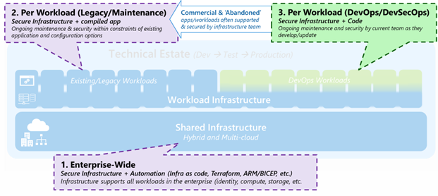

# Infrastructure security strategy

This article describes security for enterprise-wide elements that multiple workloads depend on, as shown in the following diagram:

[ .](./media/enterprise-infrastructure-security-strategy.png#lightbox)

## Strategy

Start with a proven cloud infrastructure security approach and adapt it to your organization's needs and initial workload deployments. Don't try to use a custom approach right away.

Align and improve your organization and people processes in incremental steps. Don't expect to achieve perfection right away. Determine the minimum amount of security acceptable for your organization (often called a minimum viable product or MVP) and plan to make incremental progress from there.

Align your initial MVP and incremental progress priorities with established best practices and your organization's specific business and security requirements. Make adjustments as needed over time for processes, people (training and readiness), and technical implementations.

The Cloud Adoption Framework's strategy approach also includes considerations that help you modernize strategies, architectures, and technology end-to-end on your organization's cloud adoption path. For more information, see [Defining security strategies](../strategy/define-security-strategy.md).

## Next steps

> [!div class="nextstepaction"]
> [Infrastructure security architecture](infrastructure-security-architecture.md)

> [!div class="nextstepaction"]
> [Infrastructure security implementation](infrastructure-security-implementation.md)
