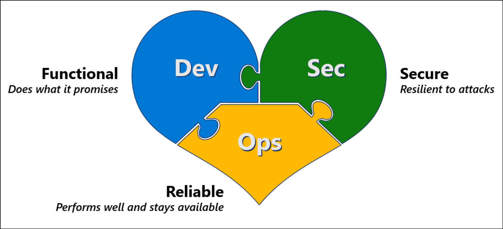

# Innovation security

Innovation is the lifeblood of an organization in the digital age and needs to be both enabled and protected. Innovation security protects the processes and data of innovation against cyberattacks. Innovation in the digital age takes the form of developing applications using the DevOps or [DevSecOps](./devsecops-controls.md) method to rapidly innovate without waiting for the traditional waterfall ship schedule that can take months or years between releases.

Developing new capabilities and applications requires successfully meeting three different requirement types:

- **Business development (`Dev`):** Your application must meet business and user needs, which are often rapidly evolving.
- **Security (`Sec`):** Your application must be resilient to attacks from rapidly evolving attackers and take advantage of innovations in security defenses.
- **IT operations (`Ops`):** Your application must be reliable and perform efficiently.

Merging these three requirements together and creating a shared culture is critically important, but often challenging. Leaders of development, IT, and security teams must work together to drive this change. For more information, see the [leadership imperative: blend the cultures](/#the-leadership-imperative-blend-the-cultures).

## What is DevSecOps?

Technology innovation is frequently developed in the context of a rapid lean and agile development approach that combines development and operations together into a *DevOps* process. We've learned that integrating security into that process is critical to mitigate risks to the innovation process, the organization's growth, and the existing assets in organization. Integrating security into the process creates a *DevSecOps* process.

## Secure by design and shifting left

As organizations adopt DevOps and other rapid innovation methodologies, security must be a thread woven throughout the tapestry of the organization and its development processes. Integrating security late in the process is expensive and difficult to fix.

Shift security *left* in the timeline to integrate it into the envisioning, design, implementation, and operation of services and products. As development teams shift to DevOps and adopt cloud technologies, security must be a part of that transformation.

:::image type="content" source="./media/waterfall-devops.png" alt-text="Security Throughout the Process" lightbox="./media/waterfall-devops.png":::

In the waterfall model, security was traditionally a *quality gate* after development finishes.

DevOps expanded the traditional development model (people, process, and technology) to include operations teams. This change reduced the friction that resulted from having the development and operations teams separated. Similarly, [DevSecOps](./devsecops-controls.md) expands DevOps to reduce the friction from separate or disparate security teams.

DevSecOps is the integration of security into every stage of the DevOps lifecycle from idea inception through envisioning, architectural design, iterative application development and operations. Teams must align simultaneously to goals of innovation speed, reliability, and security resilience. With mutual understanding and mutual respect for each other's needs, the teams will work on the most important issues first, whatever the source.

The Cloud Adoption Framework's Organize methodology provides further context on DevSecOps structures in an organization. For more information, see [Understand application security and DevSecOps functions](../organize/cloud-security-application-security-devsecops.md).

## Why DevSecOps?

DevOps brings agility, DevSecOps brings secure agility.

Nearly every organization on the planet looks to software development to gain a competitive advantage through innovation. Securing the DevOps process is critical to the success of the organization. Attackers have taken notice of this shift to custom applications and are increasingly attacking custom applications during their attacks. These new applications are often rich sources of valuable intellectual property that contain valuable new ideas that aren't yet a commodity in the marketplace.

Protecting this innovation requires that organizations address potential security weaknesses and attacks in both the development process and the infrastructure hosting the applications. This approach applied to both cloud and on-premises.

:::image type="content" source="./media/attacker-opportunities.png" alt-text="Attacker Opportunities" lightbox="./media/attacker-opportunities.png":::

Attackers might exploit weaknesses in:

- **Development process:** Attackers might find weaknesses in the application design process, for example, using weak or no encryption for communications. Or attackers might find weakness in the implementation of the design, for example, code doesn't validate input and allows common attacks like SQL injection. Additionally, attackers might implant back doors in the code that allows them to return later to exploit in your environment or in your customer's environment.
- **IT infrastructure:** Attackers can compromise endpoint and infrastructure elements that the development process is hosted on using standard attacks. Attackers might also conduct a multistage attack that uses stolen credentials or malware to access development infrastructure from other parts of the environment. Additionally, the risk of software supply chain attacks makes it critical to integrate security into your process for both:
- **Protecting your organization:** From malicious code and vulnerabilities in your source code supply chain
- **Protecting your customers:** From any security issues in your applications and systems, which might result in reputation damage, liability, or other negative business impacts on your organization

## The DevSecOps journey

Most organizations find that DevOps or DevSecOps for any given workload or application is actually a two-phase process, where ideas first incubate in a safe space and then later released to production and iteratively and continuously updated.

This diagram shows the lifecycle of this kind of innovation factory approach:

:::image type="content" source="./media/devsecops-overview.png" alt-text="DevSecOps Phases" lightbox="./media/devsecops-overview-popout.png":::

Secure innovation is an integrated approach for both of these phases:

- **Idea incubation** where an initial idea is built, validated, and made ready for initial production use. This phase begins with a new idea and ends when the **first production release** meets the minimum viable product (MVP) criteria for:
  - **Development:** Functionality meets the minimum business requirements
  - **Security:** Capabilities meet the regulatory compliance, security, and safety requirements for production use
  - **Operations:** Functionality meets the minimum quality, performance, and supportability requirements to be a production system
- **DevOps:** This phase is the ongoing iterative development process of the application or workload that enables continuous innovation and improvement

### The leadership imperative: Blend the cultures

Meeting these three requirements requires merging these three cultures together to ensure that all team members value all types of requirements and work together toward common goals.

Integrating these cultures and goals together into a true DevSecOps approach can be challenging, but it's worth the investment. Many organizations experience a high level of unhealthy friction from development, IT operations, and security teams who work independently, creating issues with:

- Slow value delivery and low agility
- Quality and performance issues
- Security issues

While having a few issues is normal and expected with new development, conflicts between teams often dramatically increase the number and severity of these issues. The conflicts occur, often because one or two teams have a political advantage, and repeatedly override requirements of other teams. Over time, the neglected issues grow in volume and seriousness. Left unsolved, this dynamic might get worse with DevOps as the speed of making decisions increases to meet the rapid evolution of business needs and customer preferences.

Solving these problems requires creating a shared culture that values dev, sec, and ops requirements that are supported by leadership. This approach will allow your teams to work better together and help solve the most urgent issues on any given sprint, whether they're improving security, operational stability, or adding critical business features.

#### Leadership techniques

These key techniques can help leadership build a shared culture:

1. **No one wins all the arguments:** Leaders must ensure that no single mindset dominates all decisions that might cause an imbalance that negatively impacts the business.
1. **Expect continuous improvement, not perfection:** Leaders should set an expectation of continuous improvement and continuous learning. Building a successful DevSecOps program doesn't happen overnight. It's a continuous journey with incremental progress.
1. **Celebrate both common interests and unique individual values:** Ensure the teams can see that they're working toward common outcomes and each individual provides something the others can't. All of the requirement types are about creating and protecting the same business value. Development is trying to create new value, while ops and security are trying to protect and preserve that value, against different risk scenarios. Leaders at all levels throughout the organization should communicate this commonality and how important it is to meet all types of requirements for both immediate and long-term success.
1. **Develop shared understanding:** Everyone on the team should have a basic understanding of:
     - **Business urgency:** The team should have a clear picture of revenue at stake. This view should include current revenue (if the service is offline), and potential future revenue that will be affected by a delay in delivery of applications and features. This should be directly based on signals from leadership stakeholders.
     - **Likely risks and threats:** Based on threat intelligence team input, if present, the team should establish a sense of the likely threats that the application portfolio will face.
     - **Availability requirements:** The team should have a shared sense of the operational requirements such as required uptime, expected lifetime of the application, and troubleshooting and maintenance requirements, for example, patching while service online.
1. **Demonstrate and model the desired behavior:** Leaders should publicly model the behavior that they want from their teams. For example, show humility, focus on learning and value the other disciplines. Another example is development managers discuss the value of security and high-quality applications or security managers discuss the value of rapid innovation and application performance.
1. **Monitor the level of security friction:** Security naturally creates friction that slows down processes. It's critical for leaders to monitor the level and type of friction that security generates:
      - **Healthy friction:** Similar to how exercise makes a muscle stronger, integrating the right level of security friction in the DevOps process strengthens the application by forcing critical thinking at the right time. If teams are learning and using those learnings to improve security, for example, considering how why, and how an attacker might try to compromise an application, and finding and fixing important security bugs, then they are on track.
      - **Unhealthy friction:** Look out for friction that impedes more value than it protects. This often happens when security bugs generated by tools have a high false positive rate or false alarms, or when the security effort to fix something exceeds the potential impact of an attack.
1. **Integrate security into budget planning:** Ensure that security budget is allocated proportionally to other investments into security. This is analogous to a physical event like a concert where the event budget includes physical security as a norm. Some organizations allocate 10 percent of total cost for security as a general rule to ensure consistent application of security best practices.

1. **Establish shared goals:** Ensure performance and success metrics for application workloads reflect development, security, and operations goals.

> [!NOTE]
> Ideally these teams should collectively create these shared goals to maximize buy in, whether for the whole organization or for a particular project or application.

### Identify the DevSecOps MVP

During the transition from an idea to production, it's critical to ensure that the capability meets the minimum requirements, or the minimum viable product (MVP), for each requirement type:

- **Developers (dev)** focus on representing the business needs for rapid delivery of capabilities that meet the expectations of users, customers, and business leaders. Identify the minimum requirements to ensure that the capability helps make the organization successful.
- **Security (sec)** brings focus to meeting compliance obligations and defending against the attackers that are continuously seeking illicit gain from the organization's resources. Identify the minimum requirements to meet regulatory compliance requirements, sustain security posture, and ensure security operations can rapidly detect and respond to an active attack.
- **Operations (ops)** focus on performance, quality, and efficiency, ensuring that the workload can continue to deliver value over the long term. Identify the minimum requirements to ensure that the workload can perform and be supported without requiring massive architectural or design changes in the foreseeable future.

The definitions for MVP can change over time, and with different workload types, as the team learns together from their own experience and from other organizations.

### Integrate security natively in the process

Security requirements must focus on natively integrating with the existing process and tools. For example:

- Design activities like threat modeling should be integrated into design phase
- Security scanning tools should be integrated into the continuous integration and continuous delivery (CI/CD) systems like Azure DevOps, GitHub, and Jenkins
- Security issues should be reported using the same bug tracking systems and processes, for example,  prioritization scheme, as other bugs.

The way that security is integrated into the process should be continuously improved as the teams learn and processes mature. Security reviews and risk assessments should ensure mitigations are integrated into the end-to-end development processes, the final production service, and the underlying infrastructure.

For more information on DevSecOps, see [DevSecOps technical controls](./devsecops-controls.md).

## Tips on navigating the journey

Transformation requires building toward this ideal state incrementally on a journey. Many organizations will have to navigate complexity and challenges on this journey. This section outlines some of the common ones that organizations face.

- **Education and culture changes are critical early steps:** *You go to war with the army you have*. The team you have will often need to develop new skills and adopt new perspectives to understand the other parts of the DevSecOps model. This education and culture change takes time, focus, executive sponsorship, and regular follow up to help individuals fully understand and see the value of the change. Changing cultures and skills drastically can sometimes tap into the professional identity of individuals, creating potential for strong resistance. It's critical to understand and express the why, what, and how of the change for each individual and their situation.
- **Change takes time:** You can only move as fast as your team can adapt to the implications of doing things in new ways. Teams will always have to do their existing jobs while they transform. It's critical to carefully prioritize what is most important and to manage expectations of how fast this change can happen. Focusing on a crawl, walk, run strategy, where the most important and foundational elements come first, will serve your organization well.
- **Limited resources:** A challenge organizations usually face early on is to find talent and skills in both security and application development. As organizations begin to collaborate more effectively, they might find hidden talent, such as developers with a security mindset or security professionals with a development background.
- **Shifting nature of applications, code, and infrastructure:** The technical definition and composition of an application is fundamentally changing with the introduction of technologies such as serverless, cloud services, cloud APIs, and codeless applications, such as Power Apps. This shift is changing development practices, application security, and even empowers non-developers to create applications.

> [!NOTE]
> Some implementations combine operations and security responsibilities into a **site reliability engineer (SRE)** role.
>
> While fusing these responsibilities into a single role might be the ideal end-state for some organizations, this is often an extreme change from current enterprise practices, culture, tooling, and skill sets.
>
> Even if you are targeting an SRE model, we recommend starting by embedding security into DevOps using practical quick wins and incremental progress outlined in this guidance to ensure you are getting good return on investment (ROI) and meeting immediate needs. This will incrementally add security responsibilities to your operations and development personnel, which gets your people closer to the end-state of an SRE (if your organization plans to adopt that model later).

## Next steps

Review the [DevSecOps technical controls](./devsecops-controls.md) for more detailed guidance on DevSecOps.

For information on how GitHub advanced security integrates security into your continuous integration and continuous delivery (CI/CD) pipelines, see [About GitHub advanced security](https://docs.github.com/en/github/getting-started-with-github/learning-about-github/about-github-advanced-security).

For more information and tooling on how Microsoft's IT organization implemented DevSecOps, see [Secure DevOps toolkit](https://azsk.azurewebsites.net/).
