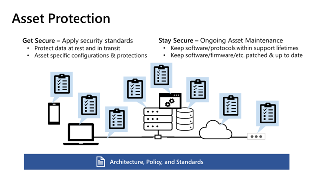

# Asset Protection

Asset Protection implements the controls to support security architecture, standards, and policy. Each asset type and security requirements are unique (identities, endpoints, applications, Azure services, etc.), but the security standards for any asset type should be consistently applied to all instances. 

Asset protection is primarily focused on consistent execution of security controls at scale (preventive, detective, and other controls) to meet the policies, standards, and architecture of the organization. Asset protection typically acts as the technical subject matter expert for assets (which is a continuous journey of learning) while working with other disciplines (governance, architecture, security operations, workload teams, etc.). Asset protection ensures that policy and standards are feasible, enables implementation of controls to support the policy and standards, and provides feedback for continuous improvement. 

Asset protection is critically important because threat actors are persistent and seek out gaps in the application of standards and policy to exploit. Attackers can directly target the business-critical data or application, but also frequently target the underlying infrastructure that grants them access to the business-critical data and applications. 

### Get Secure
The first focus area for asset protection is to Get Secure. The two activity types of getting secure are:
 - **Greenfield** - Ensuring that new assets are configured and new asset types are configured to standards is critical to avoid continuously creating technical debt that has to be addressed later at a greater expense (and results in increased risk exposure until that is done). 
 - **Brownfield** – retrofitting new security controls to existing assets. Organizations often operated IT environments for decades with security as a low or nonexistent priority, resulting in a large amount of technical debt (weak security configurations, unpatched software, unencrypted communication or storage, legacy software and protocols, etc.). Bringing security controls up to current standards and policy is critical to avoid increasing risk as attackers increase their ability to exploit it for profit with ransomware and other illicit business models)

Get Secure roughly maps to Capital Expenditures (CapEx) dynamics. The budget and cost to implement security should be linked as closely as feasible to the creation of the asset (e.g. new software project, growth of an application, cloud adoption initiative, etc.) for greenfield. For correcting brownfield, this is usually a special project funded to bring security controls up to standards/compliance.

### Stay Secure

Everything wears out or degrades over time including security configurations and standards. This happens faster than ever in the cloud age with continuous evolution of capabilities. Part of sustaining asset protection is continuing to apply the latest best practices. 
Examples 
 - **Continuous Cloud Improvement** - Azure Storage, SQL, and others regularly add security features to detect attacker activity that wasn’t available when the service first launched. 
 - **Software End of Life** - Any software, including Windows and Linux Operating sytems, will always reach end of life and security updates won’t be provided for them, potentially leaving business critical data and applications exposed to attackers. 

Ensuring your security risk level sustains or improves over time requires ongoing investment and resources. Like  regularly changing the oil in a car avoids big expensive costs over time, investing into your security posture reduces risk of a major incident. Stay Secure roughly maps to Operational Expenditures (OpEx) as it is an ongoing cost 

**Getting started**

Asset protection can be challenging for teams working to secure newer asset types like Azure and AWS Services. We recommend organizations first focus on 
**Well-known resources** like VMs, networks, identities, etc. that the team is familiar with (and which are easier to manage with newer cloud tools like Azure Security Center and Azure Defender). 
**Baselines in Azure Security Benchmark** – Microsoft provides security configuration guidance for specific Azure services that are aligned to the Azure security benchmarks

**Responsible Teams** - 

Asset Protection may be performed by IT operations teams responsible for enterprise-wide assets, DevOps/DevSecOps teams responsible for their workload’s assets, or security teams working with the IT or DevOps/DevSecOps teams. 

**Cloud Elasticity**

Unlike on premises, cloud resources may be created and destroyed over short timeframes. As needed, workloads can spin up more instances of servers, Azure Functions, etc. to perform a job and then spin them down afterward within (something within month, but sometimes within minutes or hours). Your asset protection processes and measurements should take this into account. 

**Exception Management**
Once a best practice is identified for an asset, it should be consistently applied to all instances of it. While temporary exceptions may need to be approved, these should be managed closely with expiration dates to ensure that temporary exceptions don’t become a permanent risk from attackers. 

**Challenges with measuring value/impact**

 One of the difficulties with measuring the business value of asset protection investments is that the impact of a problem isn’t often apparent until there is a real-world failure. Just like changing your oil in a car seems like an expensive nuisance until the engine fails, security vulnerabilities can appear silent and invisible until an attacker exploits them. 

**Favor Automated Policy**

Asset protection should favor automated enforcement and remediation mechanisms like Azure Policy or another automation framework. This helps avoid cost and morale issues from repeatedly performing manual tasks (and increased security risk from human errors)

## Protection and secure management

### Securing identity

Protecting identity is a key consideration when planning an organization's approach to securing assets. Identity is one the most common routes for attackers to gain unauthorized access to applications and infrastructure.This has become so important that Microsoft often calls this the "new control plane".

[Guidance is provided here for areas of consideration related to protecting and controlling access.](./security/access-control.md)

## Devices, infrastructure and networks

### Virtual machines

### Policy

Policies should be used wherever possible in order to mandate the adherence to security requirements.
This technique allows central teams to specify certain configurations that should be used in order to ensure that the virtual machine is considered secure.
For example, policies can be used to:

- Prohibit (or audit) Public IP addresses
- Enforce disk encryption
- Manage security policies for Azure Security Center
- Manage policies for log collection for virtual machines in Azure Monitor

### Endpoint detection and response (EDR)

Technologies such as Microsoft Defender should be running on all virtual machines to provide anti-malware scanning and File Integrity Monitoring (FIM).

### Disk encryption

As mentioned in earlier sections, encrypting disks provides extra layers of security and protects data at rest.

### Networks

Network infrastructure connects users and devices to applications and data. As a result, it becomes a valuable target for those looking to gain unauthorized access, given its ability to enable them to access a broad range of sensitive areas of an organization's environment.

There are techniques and technologies that can reduce the risk (or subsequent impact) of a network breach:

- Firewalls
- Network Access Control
- Network Security Groups
- Secure connectivity for inbound and outbound traffic
- Distributed Denial of Service (DDoS) Protection

#### VPN for ingress/egress

Sending or receiving data external to the business should be - wherever possible - via an encrypted network connection.
One option for this is to establish a Virtual Private Network (VPN) connection, which encrypts the network route between two fixed points.
VPNs enable smaller sites, such as branch offices to connect into the cloud environment in order to send and receive data securely.

#### ExpressRoute

For large-scale connections such as into an on-premises data centre, the Azure ExpressRoute solution can provide a secure and performant network connection between two trusted locations. ExpressRoute enables organizations to establish the secure network route for high-volume, high-frequency network traffic required as part of a hybrid landing zone implementation.

## Applications

### Microsoft Cloud Application Security

Microsoft Cloud Application Security (MCAS) enables organizations to control which Software-as-a-Service applications can be accessed. MCAS can be an effective tool in stopping the use of unauthorized file-sharing applications that move data outside of the corporate environment. Using these controls can be a strong protection against data leakage.

### Rights management inside applications

Using the rights managements techniques outlined earlier, data accessed within applications can be controlled in similar ways - even if a user has permissions within the application to extract data it is possible to apply rights to the data so that when it is extracted it is still governed and protected by the business rules applied.
This can be particularly effective for internet facing services such as files shares.

### HTTPS

For web services, all pages and connections should be encrypted using HTTPS wherever possible.

## Data

Organizations should treat the unauthorized access or theft of data among the highest impact risks to guard against.
The reputational - and often financial - impact of losing control of sensitive data can significantly affect a company's ability to operate. Protecting data is a fundamental requirement of any IT organization.
Organisations need to put security measures in place to protect data at rest, and in transit while at the same time being able to remain operational should the organization ever have to deal with an issue. Resiliency is a key piece to asset protection as well.

### Transparent Data Encryption (TDE)

TDE is a feature of Azure SQL and Azure Synapse Analytics that helps protect data at rest by performing real-time encryption and decryption of the database, backups, and logs.  

### Disk and storage encryption

Encrypting disks attached to virtual machines and storage used for applications or services helps protect data stored locally.

### Role Based Access Control (RBAC)

Access should be restricted to data to only accounts with a verified reason and only for the data sets explicitly required for the approved use. 
Access should be deliberately split between accounts that can access and accounts that can modify. Access Control based on roles is something Microsoft can help customer implement straight from the identity console. There are over 70 different built in roles with the ability to add customer roles as well. 

### Rights management

For data held outside of a database - for example on a file server - tools such as Rights Management can help to control the data leakage or misuse. Rights Management applies encryption, identity and authorization policies to files to apply controls to data as it moved around within - or even outside - the organization.

## Areas of special consideration

### DevSecOps

### OT and IOT

### Serverless
