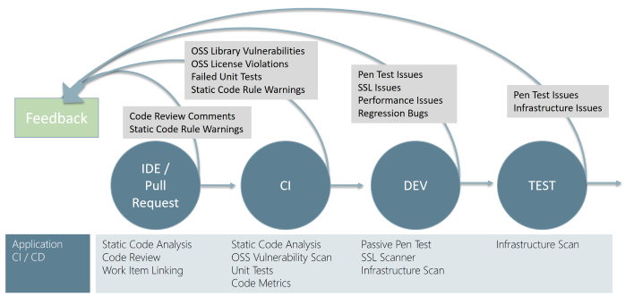

# DevSecOps Controls

DevSecOps is the native integration of security processes and tools into development processes. Because DevOps itself is an emerging discipline with a high degree of process variations, successful DevSecOps is best achieved by understanding and thoughtfully integrating security into development process. Adding security should start with low friction changes to the code, the development processes, and the infrastructure that hosts the workload. Focus first on changes that have the highest positive impact on security while placing a low burden on DevOps processes and skills.

This documentation reviews each stage of a continuous integration and continuous delivery (CI/CD) DevOps process and what security controls we recommend integrating first.

## Plan and develop

Typically, modern development follows an agile development methodology. Scrum is one implementation of agile methodology that has every sprint start with a planning activity. Introducing security into this part of the development process should focus on
 - **Threat modelling** - to view the application through the lens of a potential attacker
 - **IDE Security plugins and pre-commit hooks** - lightweight static analysis checking in the developer's environments (IDEs)
 - **Peer review and secure coding standards** - identifying good security coding standards, peer review processes, and pre-commit hooks. 

It is not mandatory to add all of those steps, but each helps discover security issues early when they are much cheaper and easier to fix. 

### Threat modelling

Threat modelling is arguably the most important security practice as it both delivers immediate results and helps develop a security mindset in developers that can improve security in all of their future projects as well. 

Threat Modelling is a very simple concept, though it can become quite detailed and technical if it needs to be. Threat modelling develops and documents a realistic security view of your application that includes:
 - How attackers can abuse the application's design
 - How to fix these issues
 - How important it is to fix them

Threat modeling effectively puts you in the mindset of an attacker and allows you to see the application through their eyes and can block their attack before they get a chance to do anything about it. If your team uses user personas in design, you can treat the attacker as a (hostile) user persona. 

There are several differently published approaches for threat modelling that range from simple question/answer methods to detailed tool-based analysis. The can be based on methodologies like [STRIDE](https://docs.microsoft.com/en-us/azure/security/develop/threat-modeling-tool-threats), [DREAD](https://en.wikipedia.org/wiki/DREAD_(risk_assessment_model)), or [OWASP Approach](https://owasp.org/www-community/Threat_Modeling). 

#### Threat Modelling - Start Simple

Because some approaches to threat modeling can be a time consuming and skill intensive process, we recommend starting with a simpler approach based on basic questions. These simpler methods aren't as thorough, but start the critical thinking process and quickly identify major security issues

These simple question for threat modelling are ideal to get your started:
 - **[Simple Questions Method (Microsoft)](https://docs.microsoft.com/en-us/security/compass/applications-services#simple-questions-method)** - This method asks specific technical questions designed to surface common security design mistakes. 
 - **[OWASP Threat modeling](https://owasp.org/www-community/Threat_Modeling)** - This method focuses on asking plain (non-technical) questions to get the process started. 

You can use either or both of these, depending on what works better for the team. 

As the team gets more comfortable with the process, they can apply more advanced techniques from Microsoft [Security Development Lifecycle](https://www.microsoft.com/securityengineering/sdl/threatmodeling) and integrate threat modeling tools like [Microsoft Threat Modelling Tool](https://docs.microsoft.com/en-us/azure/security/develop/threat-modeling-tool) to get deeper insights and help automate the process. 

Another helpful resource is [A Guide to Threat Modeling for Developers (martinfowler.com)](https://martinfowler.com/articles/agile-threat-modelling.html)

### IDE Security plugins and pre-commit hooks

Developers are focused on the speed of delivery, and security controls may slow down the process, typically if the security checks start at the pipeline. That means a developer will find out about the potential vulnerability after pushing the code to the repository. To speed up this process and give immediate feedback, it is worth adding some steps like IDE Security plugins and pre-commit hooks.

IDE Security plugins identify different security issues during the development process in the developer's comfort zone - their IDE environment. Plugins can provide immediate feedback if there is a potential security risk in the developer's written code or the third-party library or package included. Depending on the chosen IDE, many open-source or commercial plugins are provided by security companies available on the market. 

Another step worth considering is to introduce a pre-commit framework if the version control system allows it. Pre-commit is git hook scripts that will enable identification issues before submitting code for code review. One example is [pre-commit](https://pre-commit.com) and can be implemented in GitHub.

### Peer review and secure coding standards

Pull requests became standard in the development process and a part of the pull request is peer reviews that allow detecting uncovered defects, bugs or issues more related to human mistakes. It is a good practice where a security champion or knowledgeable security teammate can incorporate and guide the developer during the peer review before making the pull request. 

Additionally, secure coding practice guidelines may help ensure developers learn essential secure coding principles and how they should be applied. There are secure coding practices such as [OWASP Secure Coding Practices](https://owasp.org/www-project-secure-coding-practices-quick-reference-guide/migrated_content) available and incorporated with the general coding practices.

## Commit the code

Typically, developers create, manage, and share their code in repositories such as GitHub or Azure DevOps Repos. This approach provides a central, version controlled library of code that can be collaborate on easily. However, enabling a number of collaborators on a single codebase can also introduce the risk of changes being introduced. That risk can lead to vulnerabilities or the unintentional inclusion of credentials or tokens in commits. 

To address this risk, development teams should evaluate and implement a repository scanning capability. Repository scanning tools perform static code analysis on source code within repositories and look for vulnerabilities or credentials and flag items found for remediation. This capability acts to protect against human error and is a useful safeguard in distributed teams where a number of people are collaborating in the same repository.

### Dependency management

With the adoption of dependencies in the source code (it is known that up 90% of the code in current applications contains and is based on external packages and libraries), it is essential to address potential risks. A lot of third party libraries has serious security problems themselves. Additionally, developers not consistently implement the proper lifecycle and keep them up to date.

Developer teams should ensure that they know what components are included in their applications, be sure that secure and up to date versions are downloaded from the known sources, and there is a process for keeping them up to date. All this can be done with tools like OWASP's Dependency Check project, WhiteSource and others.

It is not enough to focus on the dependency vulnerabilities or their lifecycle only - it is important to address package feeds security. There are known attack vectors towards package management systems: typosquatting, compromising existing packages, substitution attacks, and others. Therefore responsible for the package management administration must address those risks. The good starting point is [3 Ways to Mitigate Risk When Using Private Package Feeds](https://aka.ms/pkg-sec-wp) documentation.

### Static application security testing

Once third-party libraries and package management have been addressed, it is essential to shift the focus and improve own written code's security state. There are different ways how to improve code security, like using IDE security plugins, wiring incremental static analysis pre-commit and commit checks discussed before. Of course, it is possible to do the complete source code scanning to catch some mistakes missed by previous steps. It is needed but may take some hours or sometimes days to run on a large chunk of the code. This approach can slowdown development and introduce burden.

However, there is a need to start from somewhere when to implement static code scanning practices. One way is to introduce static code analysis inside of continuous integration to verify security as soon as changes are made. One of this tool is SonarCloud, which wraps multiple SAST scanning tools for different languages. SonarCloud assesses and tracks technical debt with a focus on maintainability (code quality and style), and as a part, SonarCloud has security-specific checkers. There are many others commercial and open-source tools available on a market.

To ensure that the feedback loop is effective, it is crucial to tune the tool to minimize false positives and provide clear, actionable feedback on problems that need to be fixed. Additionally, it is good to implement the workflow, which prevents code commit to the _main_ branch if there are findings. For both quality and security findings. In this way, security becomes a part of the unit tests experience.

### Secure pipelines

DevOps brings automation on another level - everything goes through the pipelines - continuous integration and continuous delivery is a massive part of modern development. Therefore pipelines are a centric part of the development and have keys to the kingdom - infrastructure. Pipelines introduce unique security challenges: they can be compromised to run malicious code, credentials may be stolen from pipelines, an attacker without access to the production may modify the pipeline to achieve his goals, etc.

DevOps teams must ensure the proper security controls are implemented for the pipeline. Depending on the chosen platform, there are different guidelines on how to address those risks. For the Azure pipelines, there is a documentation available: [Securing Azure Pipelines](https://docs.microsoft.com/en-us/azure/devops/pipelines/security/overview?view=azure-devops)

## Build and test

Many organizations use build and release pipelines to automate and standardize the processes for building and deploying code. This use of pipelines allows development teams to make iterative changes to sections of code quickly and at scale, without the need to spend large amounts of time redeploying or upgrading existing environments. Using pipelines also enables teams to promote code from development environments, through testing environments and ultimately into production. As part of this automation, development teams should include security tools that run scripted automated tests when code is deployed into testing environments. This can include tests such as unit testing the applications features to check for vulnerabilities or checking for public endpoints to ensure they are intentionally accessible.

### Dynamic application security testing

In a classical waterfall development model, security usually was introduced on the last stop - just before going to the production. One of the most popular security approaches were penetration testing or pentest. The penetration test is an important step, which allows looking at the application from the black-box security perspective, closest to the attacker mindset. Penetration test consists of several action points, one of them is known as a DAST - Dynamic Application Security Testing. DAST is a web application security test that focuses on finding security issues in the running application by seeing how the application responds to specially crafted requests. DAST tools are also known as web application vulnerability scanners. One of them is an open-source [OWASP ZAP Zed Attack Proxy](https://owasp.org/www-project-zap/), which finds vulnerabilities in the running web application. There are several ways how OWASP ZAP does the scan: passive baseline scan or full scan depending on the configuration.

With all benefits brought by pentest, there is a downside - it takes time. The proper pentest may take up to several weeks, and with DevOps development speed, it becomes unsustainable. However, it is still worth adding a "lighter" version of pentest during the development process to uncover what may be missed by SAST and previous steps. And DAST tools like OWASP ZAP may help with that. Developers can integrate OWASP ZAP in the pipeline as a task. During the execution, the OWASP ZAP scanner is spun up in the container and does the scanning process after it publishes results. This may not be a perfect approach, as it is not complete penetration testing, but it is one more quality gate in the development cycle for improving the security posture.  

### Cloud configuration validation and infrastructure scanning

Alongside scanning and securing the code for applications, its important to ensure that the environments that applications are deployed into are also secure. This is particular key for organizations moving at pace or innovating and potentially using new technologies or creating environments quickly for experimentation. Azure has capabilities that enable organization's to create security standards from environments - such as Azure Policy that can be used to create policy sets that prevent the creation of certain workload types or configuration items such as public IP addresses. These 'guardrails' enable teams to experiment within a safe and controlled environment, therefore balancing innovation and governance.

One of the DevOps aspects when bringing closer developers and operations in cooperation is transferring infrastructure into Infrastructure as Code concept.
> Infrastructure as Code (IaC) is the management of infrastructure (networks, virtual machines, load balancers, and connection topology) in a descriptive model, using the same versioning as the DevOps team uses for source code. Like the principle that the same source code generates the same binary, an IaC model generates the same environment every time it is applied. IaC is a key DevOps practice and is used in conjunction with [continuous delivery](https://docs.microsoft.com/en-us/azure/devops/learn/what-is-continuous-delivery).

DevSecOps is shifting security left and is not only about application security, but as infrastructure security as well. Therefore, one of the steps is to introduce security scanning of infrastructure before deployed in the cloud. As infrastructure became code, it is possible to apply the same security actions as it is for application security shown in the previous challenges. There are security tools that can do the security scanning based on chosen IaC strategy.

With the adoption of the cloud, containerization became a popular approach in application architecture decisions. Even some of the container repositories scan images to catch packages with the known vulnerabilities; there is a still risk that some container may contain out-of-date software. Therefore, it is vital to scan the container for security risks, too. There are plenty of open-source and commercial security tools targeting this area and supporting tight integration in the continuous delivery process. Those tools are helping to adopt DevSecOps for infrastructure as code and specifically containers part.

## Go to production and operate

When the solution is delivered to the production, it is vital to continue overseeing and managing the security state. At this stage, it is time to focus on the cloud infrastructure and application overall. 

### Configuration and infrastructure scanning

To obtain visibility for cloud subscriptions and resource configuration across multiple subscriptions [the Azure Tenant Security Solution](https://github.com/azsk/DevOpsKit-docs/tree/master/13-Tenant%20Security%20Solution%20Setup#overview) from AzSk team can be used.

Azure includes monitoring and security capabilities designed to detect and alert anomalous events or configurations requiring investigation and potential remediation. Technologies such as [Azure Defender](https://docs.microsoft.com/en-us/azure/security-center/azure-defender), [Azure Security Center](https://docs.microsoft.com/en-us/azure/security-center/security-center-introduction), and [Azure Sentinel](https://techcommunity.microsoft.com/t5/azure-sentinel/become-an-azure-sentinel-ninja-the-complete-level-400-training/ba-p/1246310) are first-party tools that natively integrate into the Azure environments being deployed. These tools complement the environment and code security tools to provide a broad-reaching set of security monitoring to enable organizations to experiment and innovate at a pace securely.

### Penetration testing

Penetration testing is a recommended practice for environments in order to check for any vulnerabilities in the infrastructure or application configuration that may create weaknesses that attackers could exploit.

There are a number of products and partners that provide penetration testing services and [Microsoft provides guidance on how to provide notification of penetration activities.](../azure/security/fundamentals/pen-testing.md)

Testing typical covers the following test types:

- Tests on your endpoints to uncover vulnerabilities
- Fuzz testing (finding program errors by supplying malformed input data) of your endpoints
- Port scanning of your endpoints

### Actionable intelligence

Taken together, the above tools and techniques can significantly contribute towards a holistic security model for organization's wishing to move at pace and experiment with new technologies that aim to drive innovation. A key element of DevSecOps is data-driven, event-driven processes that enable the three functions to operate effectively in identifying, evaluating and responding to potential risks. Many organizations choose to integrate these alerts and telemetry into their IT Service Management (ITSM) platform in order to bring the same structured workflow to security events that they use for other incidents are requests.

### Feedback loops

All of these techniques and tools enable teams to find and flag risks and vulnerabilities that require investigation and potential resolution. Operations teams who receive an alert, or discover a potential issue when investigating a support ticket, need a route back to the development team in order to flag items for review. This feedback loop being a smooth collaboration is vital to issues being addressed quickly and the risk of a vulnerability being minimized as much as possible. A common pattern for this feedback is to integrate it into the organization's developer work management system - such as Azure DevOps or Github - to link alerts or incidents to work items for developers to plan and action. This process provides an effective way for developers to resolve issues within their standard workflow, including development, testing and release.
