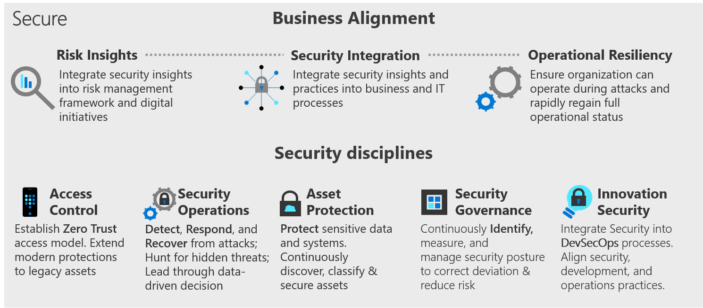

# Secure Methodology - Building security into your cloud adoption journey

Just as adopting the cloud is a journey, security for the cloud age is an ongoing journey. Cloud security is not a static destination.

## Envision a security end state

A journey without a target destination is just wandering. The Secure methodology provides a vision of the complete end state to guide your maturity over time. The following infographic provides a visual mapping of the considerations which are important to reach your end state and the key components it must include.

The Cloud Adoption Framework provides security guidance for this security journey by providing clarity for the processes, best practices, models, and experiences. This guidance is based on the lessons learned and real world experiences of real customers, Microsoft's security journey, and work with organizations like NIST, The Open Group, and Center for Internet Security (CIS).

## Mapping to concepts, frameworks, and standards

Security itself is both a standalone organizational discipline and a quality/attribute that is integrated/overlaid on other disciplines, which makes it difficult to precisely define and map in detail. The security industry uses many different frameworks to capture risk, plan controls, and operate. This is a quick summary of how the disciplines in the CAF secure methodology disciplines relates to other security concepts and guidance:

 - **Zero Trust** - Microsoft views all of security under the umbrella of Zero Trust following the three principles in (SECTION NAME). The first and most transformative part of zero trust is in access control, so we highlighted that in the access control security discipline.  
	
 - **The Open Group** - These security disciplines map closely to the XXXX in the Open Group Core principles where Microsoft actively participates. The one notable exception is that Microsoft elevated the discipline of Innovation Security so that DevSecOps is a top level element because of how new, important, and transformative this discipline is for organizations. 
	
 - **NIST Cybersecurity Framework (CSF)** - For organizations that use the NIST cybersecurity framework, we have highlighted bold text where the NIST CSF most closely maps. Modern access control and DevSecOps map broadly to the full spectrum of CSF so aren't noted invidually. 

## Mapping to Roles and Responsibilities

At the organizational level, the security disciplines map to standard plan-build-run phases seen widely across industries and organizations. While there is plan-build-run cycles and feedback loops throughout each security discipline, it's helpful to see how security maps at the macro level as security is both a unique discipline, but also just another part of business operations overall. 

We also mapped in the specific organizational functions and responsibilities that will be assigned to security roles where they primarily fit with - detailed in https://aka.ms/securityroles. Additionally we added a grouping of these roles into personas with common career and skill profiles as these provide clarity on how industry trends are impacting security career paths and skillsets:

 - **Security Leadership** - This spans across functions, ensuring that teams coordinate with each other, providing prioritization and setting cultural norms, policies, and standards for security.
 - **Security Architect** - Spans across functions with a strong emphasis on governance to ensure that all of the technical functions are working harmoniously within a consistent architecture
 - **Posture Management and Compliance** - This represents the combination of security posture management disciplines like vulnerability management with compliance reporting functions. These functions are increasingly working with the same near real-time data feeds and their scope is converging into all forms of risk and vulnerabilities to the organization (technology itself like software updates, technology configuration, and operational practices)
 - **Platform security engineer** - Technology roles focused on platforms that host multiple workloads, focused on access control and asset protection. These roles are often broken teams with specialized technical skillsets including network security, infrastructure and endpoints, identity and key management, and others. This includes preventive controls and detective controls with detective controls in partnership with SecOps and preventive controls primarily in partnership with IT Operations. 
 - **Application Security Engineer** - Technology roles focused on security controls for specific workloads, supporting both classic development models and modern DevOps/DevSecOps model. This is a blend of application/development security skills for unique code and infrastructure skills for common technical components like VMs, databases, and containers. 
>[!Note]
> As both DevOps and Infrastructure as code trends progress, we expect to see some security talent migrate from platform security engineering teams to application security teams and posture management roles. This is because the DevOps model requires infrastructure security skills (e.g. securing the "ops" in devops) and governance teams will also require these skills and experience to effectively monitor technical security posture in real time. Additionally, infrastructure as code will automate repetitive manual technical tasks, reducing the volume of time required for these skills in the platform security engineer roles (though increasing the need for broad technical skillsets and automation/scripting skills).  

For more information on detailed security functions held by roles, see https://aka.ms/securityroles

## Security Transformation

As organizations adopt the cloud, they quickly find that static security processes cannot keep up with the pace of change in cloud platforms, the threat environment, and the evolution of security technologies. Security must shift to a continuously evolving approach to match pace with this change that will transform organizational culture and daily processes throughout the organization.

To guide this transformation, this methodology provides a left-to-right maturity for business alignment (processes) and technical implementations (disciplines). These processes and disciplines create manageable steps on your security journey. Few organizations are able to jump in and implement the full methodology today. But most organizations can choose a single step & mature capabilities regarding that process or discipline.

### Change Drivers

Security organizations are experiencing two types of major transformations at the same time

- **Uplevel to business risk:** Security has been propelled into the realm of business risk management from a purely technical quality-oriented discipline. This is partly driven by digital transformation and partly by the massive increase in volume and sophistication of attacks that are enabled by the industrialization of the attack economy that makes specialized tools and skills cheap and easy for attackers to leverage.
- **Platform change:** Security is also grappling with a technical platform change to the cloud on the scale of factories shifting from running their own electrical generators to plugging into an electrical grid. While they have the right foundational skills, nearly every process and technology is changing in some way.
- **Shift in expectations:** In the past decade, digital innovation has redefined entire industries. Business agility, especially agility related to digital transformation, can quickly unseat an organization as a market leader. Likewise, loss of consumer confidence can have a similar impact on the business. The expectation has shifted from "Tell us No to protect us from what we shouldn't do." to an expectation of "Tell us how to stay safe, as we do what we must to compete."

## Guiding lasting transformation

Transforming how the business and tech teams view security requires realigment from the inside out.

- **Culture:** The culture of security must match the culture of the business mission. Cultural shift requires improved processes, partnerships, and empowerment throughout risk management and multiple levels of decision making.
- **Risk ownership:** Security is a shared responsibility across business and technoogy functions. Shared risk requires the security team to lead as an expert and a partner, advising all teams on accountable for risk outcomes.
- **Talent focus:** Deep technical talent can be augmented and/or automated. Security must lead the organization by including diverse skillsets and perspectives which will help mitigate risk and solve problems using different frameworks (business, human psychology, economics, etc.).

### Business Alignment

Because of these shifts, your cloud adoption program should focus heavily on business alignment in three categories

- **Risk Insights:** Align and integrate security insights and risk signals/sources to the business initiatives. Ensure repeatable processes educate all teams on the application of those insights and hold teams accountable for improvements.
- **Security Integration:** Integrate security knowledge, skills, and insights deeper into daily operations of the business and IT environment via repeatable processes and  deep partnership at all levels of the organization. 
- **Operational Resiliency** - Focus on ensuring the organization is resilient by being able to continue operations during an attack (even if at a degraded state) and that the organization rapidly bounces back to full operations. 

### Security Disciplines

This transformation will affect each security discipline differently. While all of these are extremely important and require investment , these are ordered (roughly) by which ones have the most immediate opportunities for quick wins as you adopt the cloud :

- **Access Control:** Application of network and identity create access boundaries and segmentation to reduce the frequency and reach of any security breaches
- **Security Operations:** Monitor IT operations to detect, respond, and recover from breach. Use data to continously reduce risk of breach
- **Asset Protection:** Maximize protection of all assets (VMs, Data, Applications, Networks, and Identities) to minimize risk to the overall enviornment
- **Security Governance:** Delegated decisions accelerate innovation and introduce new risks. Monitor decisions, configurations, and data to govern decisions made across the environment and within all workloads across the portfolio.
- **Innovation Security:** As organization adopt DevOps models to increase the pace of innovation, security must become an integral part of a DevSecOps process and integrate security expertise and resources directly into this high speed cycle. This involves shifting some decision making from centralized teams to empower workload-focused teams.

### Guiding Principles

All security activities should be aligned to and shaped by a dual focus on

- **Business Enablement:** Align to organization's business objective and risk framework
- **Security Assurances:** Focused on applying zero trust principles of
- **Assume Breach:** When designing security for any component or system, reduce risk of attackers expanding access by assuming other resources in the organization are compromised
- **Explicit Verification:** Explicitly validate trust using all available data points, rather than assuming trust. (e.g. in access control validate the user identity, location, device health, service or workload, data classification, and anomalies rather than simply allowing access from an implicitly trusted internal network)
- **Least Privileged Access:** Limit the risk of a compromised user or resource by providing just-in-time and just-enough-access (JIT/JEA), risk-based adaptive polices, and data protection to help secure both data and productivity.

