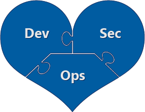

# Innovation Security

Innovation is the lifeblood of an organization in the digital age needs to be both enabled and protected. Innovation security protects the processes and data of innovation against cyberattacks. Innovation in the digital age takes the form of developing applications using the DevOps or DevSecOps method to rapidly innovate without waiting for the traditional waterfall ship schedule that can take months or years between releases.

Developing new capabilities and applications requires successfully meeting three different requirement types:
 
 - **Business/Development (Dev)** - Your application must meet business and user needs (which are often rapidly evolving).
 - **Security (Sec)** - Your application must be resilient to attacks from rapidly evolving attackers and take advantage of innovations in security defenses.
 - **IT Operations (Ops)** - Your application must be reliable and perform well.

## What is DevSecOps?

Technology innovation is frequently developed in the context of a rapid lean/agile development approach that combines development and operations together into a *DevOps* process. We have learned that integrating security into that process is critical to mitigate risk to the innovation process, the organization's growth, and the existing assets in the organizations. Integrating security into the process creates a ***DevSecOps*** process.

## Leadership and DevSecOps Culture

Meeting these three requirements often requires merging these three cultures together to ensure that all team members are working together to common goals and aren't working against each other. 

Integrating these cultures and goals together into a true DevSecOps approach can be challenging, but is always worth it. Many organizations today experience a high level of unhealthy friction from Development, IT Operations, and Security teams working independently, creating issues with

 - Slow value delivery and low agility
 - Quality and performance issues
 - Security issues

While a small number of issues is normal and expected with new development, inter-team fighting often dramatically increases the number and severity of these issues. This is often because one or two teams have a political advantage and are repeatedly allowed to override requirements of other teams, allowing those neglected issues to grow in volume and seriousness. Left unsolved, this dynamic typically typically gets worse with DevOps as the speed of decisions increase to meet the rapid evolution of business needs and customer preferences.

Solving these problems requires creating a shared culture that values Dev, Sec, and Ops requirements that is supported by leadership. This approach will allow your teams to work better together and solve the most urgent issues on any given sprint, whether they are improving security, operational stability, or adding critical business features. 

## Secure by design and shifting left

As organization adopt DevOps and other rapid innovation methodologies, security must be a thread woven throughout the tapestry of the organization and development processes. Integrating security late in the process is expensive and difficult to fix. 

You must shift security "left" in the timeline to integrate it into the envisioning, design, implementation, and operation of services and products. As development teams shift to DevOps and adopt cloud technologies, security must be a part of that transformation. 

:::image type="content" source="./media/waterfall-devops.png" alt-text="Security Throughout the Process" lightbox="./media/waterfall-devops.png":::

In the waterfall model, security was traditionally a "quality gate" after development finishes in a traditional waterfall approach.

DevOps expanded the traditional development model (people, process, and technology) to include operations teams and reduce friction having them separated. Similarly, DevSecOps expands DevOps to reduce the friction from separate or disparate security teams.  

DevSecOps is the integration of security into every stage of the DevOps lifecycle from idea inception through envisioning, architectural design, iterative application development and into operations. The first challenges to address with DevSecOps is the cultural element. Teams must align simultaneously to goals of innovation speed, reliability, and security resilience. With mutual understanding and mutual respect for each other's needs, the teams will work the most important issues first regardless of source. 

[The Cloud Adoption Framework's Organize methodology provides some further context on DevSecOps structures in an organization](../organize/cloud-security-application-security-devsecops.md)

## Why DevSecOps?

DevOps brings agility, DevSecOps brings secure agility. 

As nearly every organization on the planet looks to software development to gain a competitive advantage through innovation, securing the devops process is critical to the success of the organization. Attackers have taken notice of this shift to custom applications are increasingly attacking custom applications during the course of their attacks. These new applications are also often rich sources of valuable intellectual property, containing valuable new ideas that haven't yet been commoditized by the marketplace.

Protecting this innovation requires that organizations address potential security weaknesses and attacks in both the development process and the infrastructure hosting the applications (whether cloud or on-premises)

:::image type="content" source="./media/attacker-opportunities.png" alt-text="Attacker Opportunities" lightbox="./media/attacker-opportunities.png":::

Attackers may exploit weaknesses in both

 - **Development Process** - Attackers may find weaknesses in the application design process (e.g. using weak or no encryption for communications), or in the implementation of of the design (e.g. code doesn't check input and allows common attacks like SQL injection). Additionally, attackers may implant backdoors in code that they later return to exploit in your environment or in your customer's environment. 
 - **IT Infrastructure** - Attackers can compromise endpoint and infrastructure elements that the development process is hosted on using standard attacks. Attackers may also conduct a multi-stage attacks that use stolen credentials or malware to access development infrastructure from other parts of the environment.   

Additionally, the risk of software supply chain attacks makes it critical to integrate security into your process for both

- **Protecting your organization** from malicious code and vulnerabilities in your source code supply chain
- **Protecting your customers** from any security issues in your applications and systems (which may result in reputational, liability, or other negative business impacts on your organization) 

## The DevSecOps Journey

DevOps combines and empowers both Developers and Operations, which offers significant business benefits and operational efficiencies. This process of combining two previously “siloed” disciplines is often an all-consuming effort and often leaves security a distant third priority until or unless a security incident abruptly increases focus on security.

Whether you are reactively integrating security into the process or proactively working to prevent the next exposure, it’s important to integrate security knowledge and skills into all roles in a DevSecOps approach. Much like every airport passenger is asked “if you see something, say something”, both Dev and Ops roles play equally important parts in securing applications and their operational environment during business operations.

>[!Note]
>Some implementations of this model combine operations and security responsibilities into a site reliability engineer (SRE) role. While fusing these responsibilities into a single role may be the ideal end-state for some organizations, this is an extreme change from current practices for most enterprises given the culture, tooling, and skillsets differences between these roles. We recommend starting by embedding security into DevOps using practical quick wins and incremental progress outlined in this guidance to ensure you are getting good return on investment (ROI) and meeting immediate needs. This will incrementally add security responsibilities to your Operations (and Developer) personnel, which gets your people closer to the end-state of an SRE (if your organization wishes to adopt that model later).

Much like developers adopt a different mindset and when they are accountable for uptime and reliability, so too does assigning security accountability help them see security issues and priorities more clearly. 

## What good looks like

Security’s goal in applications should be to remain resilient in the face on continuous attacks while maximizing the agility of the organization and ability to create value from innovative application development. The overall success factors will be similar across any security program, but the program itself may vary based on the risk appetite of the organization, the availability of budget and talent, the nature of the application portfolio and development process, and other factors. 

Like the product of this process, building a successful DevSecOps program is a continuous journey with incremental progress - The hallmarks of success include:

- **Converged Culture** – Security, Development, and Operations roles should contribute key elements into a shared culture and values. This shared culture should be supported by metrics to avoid natural negative perceptions (naturally see security as a negative impact that slows progress and meeting goals) and bring unique value to all aspects of application development:
  - **Developers (Dev)** prioritize rapid delivery of value and business outcomes, which often drives mindsets and habits of creative solutions.  
  - **Security (Sec)** brings awareness of the consequences of a success attack and commonly seen attack methods, which drives a mindset of security quality and principle driven security risk reduction.
  - **Operations (Ops), both current and future**, is acutely aware of long term support and operations, driving a mindset of prioritizing predictability, stability, and supportability.

Organizations must blend all three cultures together to achieve DevSecOps and ensure that *no one mindset dominates all decisions*, as this would cause an imbalance that negatively impacts the business.

- **The right level of security friction** – Security naturally creates friction that slows down processes, it is critical to identifying which elements are healthy in your DevOps process and which are not:
  - **Healthy Friction** – much like the resistance in exercise makes a muscle stronger, integrating the right level of security friction in the DevOps process strengthens the app by forcing critical thinking at the right time. This typically takes the form of considering how why and how an attacker may try to compromise an application during design creation and review and automatically identifying security vulnerabilities an attacker can exploit as the application is developed. 
  - **Unhealthy friction** – impedes more value than it protects. This often happens when security bugs generated by tools have a high false positive rate (e.g. false alarms) or when the security effort required to address items far exceeds the potential impact of an attack.
- **Commitment to shared goals** - Because security decisions often require difficult judgement calls that may spur conflicting opinions, it’s critical that all team members have a shared understanding of desired outcomes that combine and supersede individual preferences. This clarity of goals and shared accountability helps overcome natural conflicts between the individual legacy cultures. The shared goals of these teams should balance innovation/speed, minimizing security, and minimizing operational risk based on a shared understanding of Business Risk Appetite:

- **Business urgency** – the team should have a clear picture of revenue at stake. This should include current revenue (if service offline) and potential future that would be impacted by a delay in delivery of applications and/or features. This should be directly based on signals from leadership stakeholders.
- **Likely risks and threats** – based on threat intelligence team input (if present), the team should establish a sense of the likely threats that the application portfolio will face.
- **Availability requirements** – the team should have a shared sense of the operational requirements such as required uptime, expected lifetime of the application, and troubleshooting/maintenance requirements (e.g. patching while service online)  

>[!Note]
>Ideally these teams should collectively create these shared goals to maximize buy in, whether for the whole organization or for a particular project or application. 
>
> Additionally, senior leadership within the organization must formalize these cultural priorities, model the behavior, and continually reinforce the importance of innovation, reliability, and security. 

- **End to End approach** – As developers increasingly include open source components into applications, security strategy and controls must extend across the full software supply chain to ensure .  (position the OS component authors and cloud providers as de facto partners [you depend on these other to achieve your work outcomes] where you have to develop a different strategy than the stuff you manage directly)
- **Native Integration** – because the whole DevSecOps team will be accountable for rapid delivery of applications and features, security capabilities should be integrated natively into workflows to reduce unhealthy friction as much as possible. This can take the form of:
  - Tools are integrated natively into the automated CI/CD process
  - Developers have an equally important view of application quality and security as a quality metric. 
  - Developers and managers are able to assess the potential business impact of a security compromise on the application itself and the organization itself (on their own or in partnership with security and business teams
- **Continuous Improvement**
  - Security (and quality) bugs are steadily decreasing over time
  - Outside views are brought in to provide a sanity check on security periodically
- **Threat modelling** is done for every business critical application, during design and periodically as major changes are planned. Threat modelling enables the team to adopt the mindset of an attack and develop clarity on what security issues to address and which are most important. 
- **Process driven approach** – you can’t modify something that doesn’t exist. Structured repeatable process that enables consistent outcomes and continuous improvement because it doesn’t rely only on the expertise of specific individuals by capturing their knowledge into processes that sustains 80% of the value, can train new people easily, etc.

## Navigating the Journey

Transformation requires building towards this ideal state incrementally on a journey. Many organizations will have to navigate complexity and challenges on this journey, this section outlines some of the common ones that organizations face. 

- **Education and culture change are critical early steps** – “you go to war with the army you have” – the team you have will often need to develop new skills and adopt new perspectives to understand the other parts of the DevSecOps model. This education and culture change takes time, focus, executive sponsorship, and regular follow up to help individuals fully understand and fully see the value of / buy-in to the change. Changing cultures and skills this much can sometimes tap into professional identity of individuals, creating potential for strong resistance. It's critical to understand and articulate the why, what, and how of the change for each individual and their situation.
- **Change takes time** – You can only move as fast as your team can adapt to the implications of doing things in new ways. Teams will always have to perform their existing jobs while they transform, so it is critical to carefully prioritize what is most important and to manage expectations of how fast this change can happen. Focusing on a crawl, walk, run strategy where the most important and foundational elements come first will serve your organization well. 
- **Limited Resources** – An early challenge organizations usually face is to find funding and talent that is skills in both security and application development. As organizations begin to collaborate more effectively, they may find hidden talent such as developers with a security mindset or security professionals with a development background. 
- **Shifting nature of applications, code, and infrastructure** – The technical definition and composition of an “application” is fundamentally changing with the introduction of technologies like serverless, cloud services, cloud APIs, and codeless applications (such as Power Apps). This is changing development practices, application security, and even empowering non-developers to create applications.

### Tips on overcoming these challenges

So that’s a lot of challenges, now lets talk about the methods to overcome them. The DevSecOps teams should establish (and regularly refine) processes around
 - **Normalize Security** - ensure that all security elements fit within existing development processes to limit unneccesary friction. Proceses may need to be extended or changed, but limit this as much as you can without losing security outcomes. Some examples include
      - **Align Security bug bar** for security and non-security bugs to the terminology and prioritization/classification already used by the DevOps/DevSecOps Teams. Ensure you have clear criteria for what types of security issues will be addressed in what priority order. 
    - **Attacker Personas and Threat modelling** - integrate attacker persona(s) into the application design similar to user personas and using them to threat model the application to understand how attacker could abuse it and how to adjust the design accordingly
 
- **Evaluate Business impact** – Estimate the potential business impact of a compromise of the application. This will help identify how much effort should be put into security efforts for this application relative to other applications. Business impact could include potential loss of human life/safety or data/application confidentiality, integrity, or availability. You should consider both:
  - **Primary effects** – business impact if the application or it's data is controlled by attackers. 
  - **Second, third, or Nth order effects** – business impact to other applications and data that the application has access to. One example is a customer facing web application may be able to change records in another application's database that uses those same records to send financial payments. Another example is an internet facing web server that is running as an administrative user of the operating system, which would allow an attacker that controls the application to steal credentials from that system and use them to attack other systems in the organization. 
  
- **Automate Security Tooling** - Integrate security tools that can scan for security bugs into the CI/CD pipeline. Ensure the bugs are part of the normal develop process generating security findings (and quality rating of them via false positive rate)

This clarity will naturally help identify and resolve tension between security and productivity goals as the team encounters decisions during daily workflows.

## Next Steps

For information on how GitHub Advanced Security integrates security into your continuous integration and continuous delivery (CI/CD) pipelines, see [About GitHub Advanced Security](https://docs.github.com/en/github/getting-started-with-github/about-github-advanced-security)

For additional information and tooling on how Microsoft's IT organization implemented DevSecOps, see the [Secure DevOps Toolkit](https://azsk.azurewebsites.net/)

