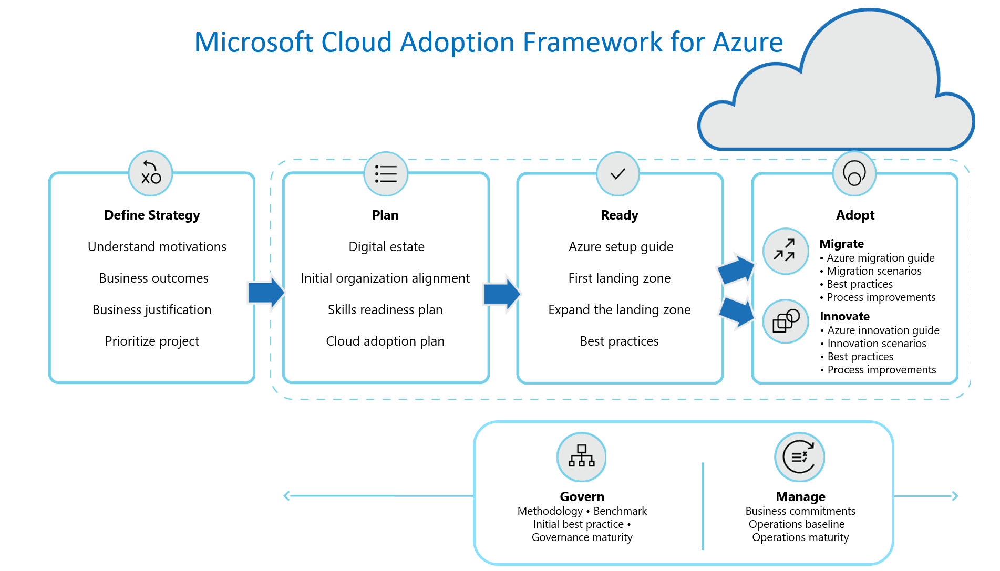

# Balance competing priorities

Embarking on any digital transformation journey acts like a forcing function for stakeholders, across the business and technology teams. The path to success is firmly rooted in the organization's ability to balance competing priorities.

Similar to other digital transformations, cloud adoption will expose competing priorities throughout the adoption lifecycle. Like other forms of transformation, the ability to find balance in those priorities will have a significant impact on the realization of business value. Balancing these competing priorities will require open and sometimes difficult conversations between stakeholders (and sometimes with individual contributors).

This article outlines some of the competing priorities commonly discussed during the execution of each methodology. We hope this advanced awareness will help better prepare for those discussions when developing your cloud adoption strategy.

The following sections align to the flow of the cloud adoption lifecycle visual above. However, it's important to recognize that cloud adoption is iterative (not a sequential process) and these competing priorities will emerge (and sometimes reemerge) at various points along your cloud adoption journey.

## General theme of the Cloud Adoption Framework approach

Monolithic solutions and advanced planning are both built on a series of assumptions that may (or may not) prove to be accurate over time. Adopting the cloud is often a new experience for the business and the technical teams. As with most new experiences or learning opportunities, there is a high probability that those assumptions will be proven false.

Following proven agile principles of delayed technical decisions is the favored approach for most guidance within this framework. That approach follows a consistent pattern: establish a general end-state, move quickly to initial implementation, test and validate assumptions, and refactor early to address assumptions. This type of growth mindset maximizes learning and minimizes risk to business value, but it requires some comfort with ambiguity.

At times, ambiguity can be scarier (or more dangerous) than false assumptions. While this framework leans towards learning and addressing ambiguity during execution, there are a many situations that require the team to lean towards analysis-based or assumption-based approaches. The following sections will attempt to illustrate at least one "expanded scope example" in each section to illustrate times when a second deeper iteration would be valuable.

## Balance during the strategizing phase

The core objective of the Strategy methodology is to develop alignment between stakeholders. Once defined, that aligned strategic position will drive behaviors throughout each of the methodologies to ensure that technical decisions align desired business outcomes. Fostering alignment between stakeholders creates a common set competing priorities: **depth of justification** versus **time to business impact**.

**Competing priorities:**

- **Depth of justification:** Stakeholders often want a deep financial analysis and full business justification to be comfortable aligning to a strategic direction. Unfortunately, that level of analysis may require an extended time period to allow for data collection and analysis.
- **Time to business impact:** Conversely, stakeholders are often held accountable for delivering business outcomes within defined time frames. Time consuming analysis and assessment can put those outcomes at risk before the technical work even begins.

**Minimum scope:** Finding this balance requires stakeholder discussions early in the process. The Strategy methodology suggests limiting the scope of alignment during this early effort. In the suggested approach, stakeholders focus on aligning around a set of core motivations, measurable outcomes, and a high-level business justification. Stakeholders should then quickly commit to a small number of initial projects or pilots to drive required learning opportunities.

**Expanded scope example:** If the initial business analysis indicates a high risk of negatively affecting the business, then stakeholders may need to slow down and more cautiously evaluate a deeper analysis during business justification.

## Balance during the planning phase

Similar to the priorities during the strategizing phase, there's a need during the planning phase to balance the depth of initial planning versus delayed technical decisions.

**Competing priorities:**

- **Depth of initial planning** regarding technical implementation in the cloud often contains a high number of assumptions. Especially when the team has skill gaps, the environment suffers from discovery gaps, or the workloads don't have clearly defined architectural end-states. All of these assumptions are common in detailed cloud adoption plans. Experimentation, pilots, and qualitative analysis are required to remove these assumptions.
- **Delayed technical decisions** assume that the later a technical decision can be made, the more accurate that decision will be. Following principles of agile product planning will help delay technical decisions, allowing them to happen at the right time with sufficient information. However, this approach results in a much higher degree of ambiguity in the initial plan.

**Minimum scope:** Agile product development approaches are suggested to drive prompt action within manageable plans. The Plan methodology recommends the following steps to achieve this balance. Inventory the full digital estate using automated discovery tools, but use incremental rationalization to plan as far as the next 1-3 months of work. Ensure proper organizational alignment to move quickly. Create a skills readiness plan for the assigned team. Use the strategy and plan template to quickly deploy an initial backlog.

**Expanded scope example:** At times, delivery of a cloud adoption plan may be responding to a time-sensitive or high-impact business event. When success requires the movement of a high-number of assets in a fixed period of time, the steps above are often followed with a deeper planning effort. The key to success in these scenarios, is to plan enough to get going and then plan for the full engagement. This approach reduces the likelihood of planning blocking business outcomes.

## Balance during the readiness phase

When adoption teams are preparing for their first steps into the cloud, there are often competing priorities between time to adoption and long-term operations. The team may struggle with being well suited to deliver on the task at hand versus being well managed. This struggle is necessary in traditional IT environments, where the act of developing a platform requires physical assets and acquisition cycles. However, when the entire IT platform is defined in code, traditional development tactics (like refactoring) reduce the need to be well managed from the beginning.

**Competing priorities:**

- **Long-term operations:** Customers often get blocked by the desire to have a cloud environment that meets feature parity with current operations management, governance, and security systems. In a current study of customers, more than 90% of the customers required support getting past this mindset. This blocker injects months of delay slowing or preventing business impact.
- **Time to adoption:** Cloud-based tools like Azure Policy, Azure Blueprints, and management groups allow for ease of refactoring across the IT platform. Additionally, predefined landing zones provide opinionated positions to accelerate deployment towards an environment that already meets many of the feature parity requirements. Together there are opportunities to accelerate time to market, with minimal impact on long-term operations.

**Minimum scope:** The Ready methodology outlines a direct path from rapid adoption to long-term operations. This approach starts with a basic introduction to the tools that enable environment refactoring. Based on those tools and environmental requirements, customers are guided to a selection of predefined landing zones (each delivered using infrastructure as code models). That code can then be refactored during the course of cloud adoption to improve operations, security, and management postures.

<!-- docutune:casing "Govern and Manage methodologies" -->

**Expanded scope example:** For teams whose adoption plan calls for a mid-term objective (within 24 months) to host **more than 1,000 assets (applications, infrastructure, or data assets) in the cloud**, a more robust view of landing zones is suggested. In these situations, the Govern and Manage methodologies should be considered during initial landing zone conversations. However, this deeper consideration often adds weeks or months to a cloud adoption plan. To minimize impact on business outcomes, the adoption team should pilot actual workloads in the cloud in parallel to the creation of a more mature landing zone and central architecture solution.

## Balance during the migration phase

During migration efforts, it's common for adoption teams to assume that workloads will be rehosted in the cloud in their current as-is configuration. This directly competes with a forward-looking view to rearchitect every workload to better take advantage of cloud capabilities. However, the two are not mutually exclusive and can be complimentary when managed through a common process.

**Competing priorities:**

- **Rehost:** Customers often equate migration to a *lift and shift* motion of replicating all assets to the cloud in their current state configuration. This results in little drift within the IT portfolio. This approach is also the fastest way to retire assets in an existing datacenter.
- **Rearchitect:** Modernizing the architecture of each workload maximizes the value of the cloud across cost, performance, and operations. However, this approach is much slower and often requires access to each applications' source code.

**Minimum scope:** During early-stage planning, use the rehost option for planning, with a clear understanding that this option is an initial business assumption and not a technical decision. In the Migrate methodology, the cloud adoption team would then challenge this assumption for each migrated workload. This methodology follows the assess/migrate/promote approach for each workload or group or workloads creating a migration factory. During the assessment phase, the adoption team evaluates technical fit and architecture of each workload. That assessment effort seldom results in a pure lift-and-shift approach because many of the components in the architecture tend to be selected for refactoring and modernization.

**Expanded scope example:** For mission-critical or high-sensitivity workloads, like a mainframe or multitier microservices application, a deeper assessment of the workload may be required during the assessment phase. In these rearchitecture situations, customers should use the Microsoft Azure Well-Architected Review and the [Microsoft Azure Well-Architected Framework](/azure/architecture/framework) to refine workload requirements during the assessment.

## Balance during the innovation phase

True customer-facing innovation creates common conflicting priorities between the need to deliver on a planned feature set and a customer empathy development process.

**Competing priorities:**

- **Feature focus:** Initial plans for innovation build on the existing digital estate and cloud capabilities to deliver a set of features that meet a customer need. It's easy to allow the plan to drive technical implementation, leading to a feature focused development effort. This approach often leads to temporary stakeholder satisfaction but reduces the likelihood of driving innovation that impacts customer behaviors.
- **Customer empathy:** Initial plans are an important part of the business side of development and should be included in regular reporting. However, learning, measuring, and building with customer empathy is a more accurate measure of success in an innovation effort. Focusing on the customer over features is more likely to result in both short-term and long-term customer satisfaction and business impact.

**Minimum scope:** The Innovate methodology illustrates how to integrate strategy and plans through business value consensus. The guide then introduces cloud-native tools that can accelerate each discipline of innovation, accompanying best practices for implementation. Finally the process improvements section demonstrates approaches to building customer empathy while respecting plans and strategies across the cloud adoption journey. This approach focuses on delivering innovation with the use of as little technology as is possible.

**Expanded scope example:** At times, an innovation may be dependent on mission-critical or high-sensitivity workloads. When the "customer" is an internal user, the development effort may be both mission-critical and high-sensitivity during the earliest of iterations. For these scenarios, adoption teams should use Microsoft Azure Well-Architected Review and Microsoft Azure Well-Architected Framework to evaluate advanced architectural design early in the process.

## Balance during the governance phase

The practice of cloud governance is a constant balance between two competing priorities: speed and agility versus a well-governed environment. The cloud governance team focuses on evaluating and minimizing risks to the business through uniform controls and minimizing change. The adoption team focuses on driving business outcomes, which require new risks and inherently creates change.

**Competing priorities:**

- **Well-governed:** Every control designed to minimize risk blocks some aspect of change or limits design options. Control is essential to a well-governed environment. However, when controls are designed and deployed in isolation, they can be as damaging as the risks they are intended to prevent.
- **Speed and agility:** Speed and agility are fundamental business requirements in the digital economy. Both require the ability to drive change with minimal blockers to innovation or adoption. When change is driven in isolation of governance, it generates new risks that could harm the business in unintended ways.

**Minimum scope:** The Govern methodology suggests that neither governance nor adoption should ever happen in isolation. This methodology starts with an understanding of the governance disciplines and a conversation around business risk, policy, and process. As an active member throughout the cloud adoption journey, the governance team can implement a minimum set of guardrails to address the tangible risks within the cloud adoption plan. Over time the governance team can refactor and expand those guardrails to meet new risks. This approach maximizes learning and innovation, while minimizing risk.

**Expanded scope example:** When the business risk is high, especially early in adoption, the cloud governance team may be required to accelerate the expansion of governance implementations. The same guidance and exercises can be used to add this higher level of governance, but timing may have to be accelerated. In some scenarios, an advanced state of governance may even be required during the deployment of the first landing zones.

## Balance during the management phase

The IT business model regarding operations management has been continuously evolving over the last decade. As hardware maintenance moves further from IT's core value proposition, the view on operations management has shifted as well. As IT increases a focus on delivering business value, operations management teams are conflicted with balancing no-ops/low-ops versus broad investments.

**Competing priorities:**

- **Broad investments:** Investing equally in outage avoidance, rapid recovery, and monitoring across the environment is the traditional approach to operations management. This approach can be costly and sometimes duplicates the supporting products made available by the cloud vendor.
- **No-ops and low-ops:** Use cloud-native operations tools to minimize repetitive and recurring tasks previously delivered by full-time employees. Reducing these operational dependencies in the operations management model frees those employees to drive more value. Alone, this approach can lead to subpar operations support.

**Minimum scope:** The Manage methodology suggests establishing a cloud-native, no-ops baseline. Acknowledging that the no-ops baseline will not meet all business needs, work with the business to define commitments and better align investments. Expand the baseline to meet common needs for all workloads. Then enable platform teams or specific workload teams to maintain well-managed solutions within a well-managed environment.

**Expanded scope example:** In most environments, a small percentage of workloads whose business value justifies deep investments in operations from IT. In those scenarios, the IT team might want to use Microsoft Azure Well-Architected Review and Microsoft Azure Well-Architected Framework to guide deeper operations.

## Balance during the organization phase

The competing priorities throughout this article are reflective of IT's drive to deliver on business demands for speed and agility. This same shift is showing up in changes to org charts (or virtual team structures) to empower greater support for business outcomes. As IT leaders reflect on team structures, two competing priorities are commonly addressed: centralized control versus delegated control.

**Competing priorities:**

- **Centralized control:** This operating model focuses on centralization of all controls required to enforce rigid policies. In this model, IT serves as a blocker to innovation, speed, and agility. However, IT can ensure a higher degree of stability, compliance, and security.
- **Delegated control:** In this distributed operating model, it is assumed that each DevOps team or business application team will provide their own set of controls, based on the solutions required to deliver on business objectives. In this model, IT provides guardrails to help keep the teams on the road, but minimizes the number of forced technical constraints whenever possible.

**Minimum scope:** Most organizations will go through a natural set of evolutions over time. The Organize methodology outlines the most common series of evolutions. The suggested guidance is for teams to strive to move towards a cloud center of excellence (CCoE) structure to deliver delegated control approaches.

**Expanded scope example:** There are many situations that would trigger a need for centralized control. Third-party compliance requirements and temporary security exposure are two examples of triggers for centralized control. In these situations, there is commonly a need to establish limiting policies and rigid, fixed controls. However, to enable innovation and adoption to continue, it is encouraged that central IT teams deliver those controls based on criticality and sensitivity of each workload. Providing environments with less control but a reduced scope or risk profile, allows for flexibility even when control is required.

## Next steps

Learn to [balance migration, innovation, and experimentation](./balance-the-portfolio.md) to maximize the value your cloud migration efforts.

> [!div class="nextstepaction"]
> [Balance the portfolio](./balance-the-portfolio.md)
