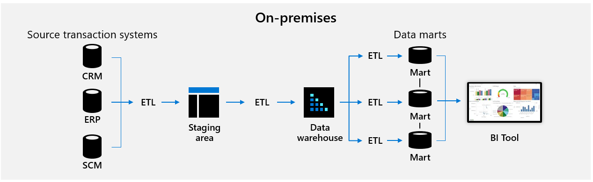

# Support business with data innovation

Many companies keep data warehouses in their datacenters to help different parts of their business analyze data and make decisions. Sales, marketing, and finance departments rely heavily on these systems in order to produce standard reports and dashboards. Companies also employ business analysts to perform ad hoc querying and analysis of data in data marts. These data marts use self-service business intelligence tools to perform multidimensional analysis.

A business that's supported by data innovation and a modern data estate can empower a broad range of contributors, from an IT stakeholder to a data professional and beyond. They can take action on this repository of centralized data, which is often referred to as "the single source of truth."

Azure Synapse Analytics is a single service for seamless collaboration and accelerated time-to-insight. To understand this service in more detail, first consider the various roles and skills involved in a typical data estate:

**Data warehousing:** Database admins support the management of data lakes and data warehouses while intelligently optimizing workloads and automatically securing data.

**Data integration:** Data engineers use a code-free environment to easily connect multiple sources and types of data.

**Big data and machine learning:** Data scientists build proofs of concept rapidly and provision resources while working in the language of their choice (for example, T-SQL, Python, Scala, .NET, or Spark SQL).

**Management and security:** IT pros protect and manage data more efficiently, enforce privacy requirements, and secure access to cloud and hybrid configurations.

**Business intelligence:** Business analysts securely access datasets, build dashboards, and share data within and outside their organization.

## An overview of classic data warehouse architecture

The following diagram shows an example of a classic data warehouse architecture.

*Figure 1: Classic data warehouse architecture.*

Known structured data is extracted from core transaction processing systems and copied into a staging area. From there, it's cleaned, transformed, and integrated into production tables in a data warehouse. It's common for several years of historical transaction data to build up here. This provides the data needed to understand changes in sales, customer purchasing behavior, and customer segmentation over time. It also provides yearly financial reporting and analysis to help with decision making.

From there, subsets of data are extracted into data marts to analyze activity associated with a specific business process. This supports decision making in a specific part of the business.

For a business to run efficiently, it needs all types of data for the different skills and roles described earlier. You need raw data that has been cleansed for data scientists to build machine-learning models. You need clean and structured data for a data warehouse to provide reliable performance to business applications and dashboards. Most importantly, you need to be able to go from raw data to insights in minutes, not days.

Azure Synapse Analytics has a native, built-in business intelligence tool with Microsoft Power BI. Here, one service within one interface supports you to quickly transform raw data into a dashboard that displays insights.

## Next steps

<!-- TODO: More detail needed here. -->

[Data innovations](./data-innovations.md)
