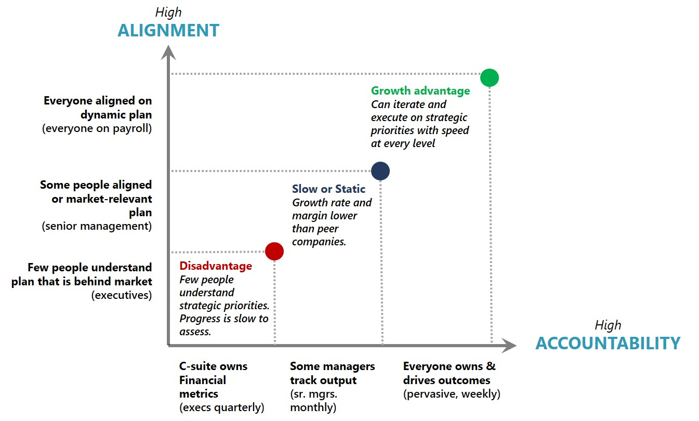

<!-- docutune:casing WorkBoard -->

# Measure business outcomes using objectives and key results (OKRs)

Modern operations require modern ways to measure business outcomes, and cloud technology can help to increase velocity for a business. An organization's measurement platform should support a company's outcomes and plan for growth by:

- Providing insights to team members and groups.
- Supporting staff to pivot quickly when outcomes don't align with strategy and expectations.
- Offering a structured format, templates, sequences, and tools to help teams plan and visualize for increasing velocity.

## An overview of objectives and key results (OKRs)

Many organizations have started to adopt objectives and key results (OKRs). OKRs have proven to drive alignment in complex work environments, foster innovation, and help individuals to focus on what matters. The two components comprising OKRs are an objective and key results for that objective. An objective is the statement of intent: what is the team trying to accomplish, and why is it important? Key results are specific outcomes that track impact on the objective.

**Objective:** Clarity and intent.

**Key results:** Measures of success within a quarter.

It's important to understand that OKRs are useful for measuring team outcomes versus individual performance. Since deadlines often motivate team performance, key results are established quarterly. OKRs help teams to focus on the most important tasks instead of the volume of work at hand.

To do this, focus on what happens in a month, a quarter, and other short-term intervals. You can have OKRs that last longer, but shorter intervals emphasize the need for OKRs that track short-term impact.

## OKR key principles

[WorkBoard](https://www.workboard.com) is a company that focuses solely on OKRs and offers software solutions to help customers adopt them. According to the company, the key principles of OKRs are:

- **Aspire and inspire:** Teams establish their best possible results in a given quarter, focus efforts on great outcomes, and use retros to learn and iterate.

- **Outcome focus:** Quarterly key results provide clarity on where value is created. This helps teams and the organization to drive business impacts faster.

- **Global and local:** Teams localize OKRs into their nouns, verbs, and numbers that enrich OKRs with the team's expertise and insights.

- **Transparent:** OKRs, alignment, and progress are visible to everyone with OKR software, simplifying collaboration and making good decisions faster.

## How OKRs add value to an organization

OKRs help to create alignment and accountability within organizations.

*Figure 1: How OKRs increase alignment and accountability within organizations to help them meet goals faster.*

Learn more about how your team can align [strategy and execution](https://www.workboard.com/blog/execution-vs-strategy.php) during planning and execution phases.

## Examples of OKRs

The principles defined by WorkBoard can help your organization to understand how useful OKRs take form. Objectives need to inspire your company and its teams to fully understand your mission. Key results need to be specific and measurable within the quarter.

Here are some example of OKRs:

**Objective 1:** Be the top US provider of learning platforms to schools.

**Key results:**

1. 45 percent of K-12 schools using our platform
1. A 12 percent increase in student engagement, as measured through internal systems
1. A 95 percent satisfaction rate from quarterly parent surveys

**Objective 2:** Build a technology platform that supports every person in our business to innovate and create.

**Key results:**

1. Five new applications developed and adopted across the organization
1. Every team with at least two members using the Microsoft Power Platform
1. Including new cloud technologies like data analytics and machine learning in all customer-facing applications

**Objective 3:** Transform our approach from sales-driven to data-driven.

**Key results:**

1. Increasing pipeline coverage from 50 percent to 200 percent
1. Increasing closing rates for sales engagements by 5 percent
1. Reducing the time to close deals by 8 percent

## Next steps

Five steps can help your organization to move forward with OKRs:

**Step 1: Learn:** Start exploring what OKRs can do for your business, and tune in to some of your industry peers and leaders to learn about how OKRs have benefited their organizations.

**Step 2: Plan:** As you begin to draft your OKRs, ensure that your sponsors are contributing and involved in the process. Work with an OKR coach to refine your OKRs.

**Step 3: Launch:** Each organization launches initiatives differently. Maintain a strong communication plan, and build the OKR calibration and celebration process into your operating model.

**Step 4: Drive:** To maintain rigor and focus, make sure that you're sharing outcomes and results across the organization. This will help your teams to adopt a habit of using OKRs.

**Step 5: Improve:** Continue to improve, revisit, and rethink how to connect further across the organization. OKRs in spreadsheets can be useful, but an organization can benefit most from everyone participating to meet objectives and gaining insights from the aligned data.

Contact [WorkBoard](https://appsource.microsoft.com/product/office/WA104381599) to get started.

> [!div class="nextstepaction"]
> [Align efforts for learning metrics](../learning-metrics.md)
