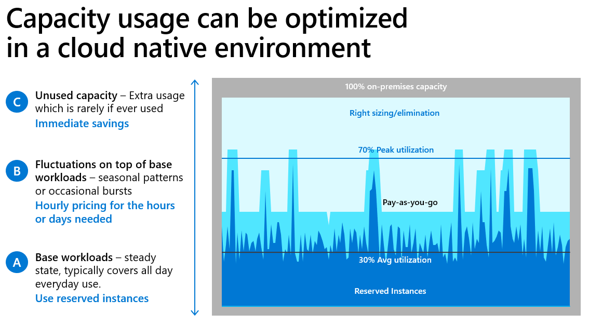

# Build a business justification for cloud migration

Developing a business case for moving to the cloud includes building a financial plan. This plan provides a view of the technical and financial timeline of your environment. Before you start building your business case and creating your financial plan, it's important to understand the key principles of cloud economics. These core principles will help you develop a clear business justification with tangible costs and returns.

## Benefits of moving to the cloud

The cloud drives two core benefits:

- Technical benefits
- Financial benefits

### Technical benefits

**Scalability**: When you start looking at deploying workloads to the cloud, there's abilities that are limited on-premises and more accessible in the cloud, one of them being scalability. In the cloud, you can scale out your resources depending on usage, utilization, and demand.

**Availability**: Availability is another technical benefit of migrating to the cloud. It's more costly to build highly available infrastructure on-premises than to architect highly available infrastructure in the cloud.

**Security and compliance**: Security and compliance is a technical benefit of moving to Azure. Security infrastructure and toolsets are continually being updated to keep you current with what's transpiring with security threats on global networks. You benefit from corporate learnings around securing the platform, new methodologies of intrusions and attacks, and learnings from multiple services beyond Azure.

**Capacity optimization**: Capacity optimization, where you pay only for the resources that you use over time, is another technical benefit of moving to the cloud. Your capacity can fluctuate depending on your particular demands. During higher load times within a business cycle, you can scale down resources and your overall capacity, or scale up depending on what’s required.

 The cloud improves how you deploy and provision or deprovision resources because it’s done dynamically. On-premises datacenters are frequently over-built to handle usage peaks, which might result in excess capacity and excess spend. For example, if your datacenter operates at a baseline of 30 percent, with regular spikes up to 70 percent, there's room for optimization in the cloud.

The core technical benefits reviewed focus on the lift and shift model, taking your workloads and migrating to infrastructure-as-a-service (IaaS) in the cloud. As you free up cash flow through the different levels of cloud adoption and mature your workloads, you're freeing up cash flow. You can reinvest this cash flow to modernize to different service levels. The goal is to get the most out of your on-premises investment, and then move those workloads to IaaS, potentially freeing up 20% to 30% of the overall required cash flow. Historically, this process would be considered a savings opportunity. This approach is better viewed as a reinvestment opportunity.

You can review the workloads in IaaS and make decisions as to what can move to platform-as-a-service (PaaS). You’ll still cater to the same type of service delivery, however, you'll deliver it at a lower cost with more features and functionality. There’s potential for moving some workflows and line-of-business applications to software-as-a-service (SaaS). gain even more value out of every dollar of investment.

When you plan the phases of maturity for your workloads over the long term, you can achieve more with every dollar.

### Financial benefits

A digital transformation goes hand-in-hand with a financial transformation. When you're planning a migration to the cloud, there are financial considerations around how the cloud will affect your financial position, accounting, KPIs, and processes.

 Different cost models are used in the cloud in comparison to on-premises. On-premises uses fixed cost models, where the cloud uses variable cost models. In the cloud, you must think about the opportunities there are to unlock value. Take advantage of the technical benefits, that will in turn increase your financial benefits.

Cloud pricing and the variable cost model are fundamentally different from on-premises pricing and the fixed cost model. Understanding the opportunities the cloud can provide and how to unlock them is a critical step in evaluating your digital transformation plans.

When you move from on-premises to the cloud, you're shifting how you acquire capacity. You're moving from an upfront cash flow, to an upfront spend for your capacity in the cloud, in a over time pay-as-you-go model. On-premises, you're fixed in your capacity whatever your demand looks like. Your cost structure and your capacity are both fixed. If revenue goes down and you need to reduce your IT costs, your options are limited. The assets have already been purchased.

You can scale up and down in the cloud as demands of your business change. You're able to shift your capacity up and down and use a variable cost model as opposed to a fixed cost model. The elasticity of the cloud provides a way to pay only for the resources you use. For your static workloads, you can take advantage lower costs by using the reserved instance pricing available in the cloud.

**OPEX pricing models**: One of the financial benefits of the cloud is the shift from CAPEX to OPEX and improved cashflow timing. In an on-premises environment, spend is in the capital expenditure category. When you move to the cloud, you frequently see a transition to operating expenses - spend that is over time, as you need it. Rather than paying for a resource up-front, you pay for the resource as you need it, resulting in improved cashflow timing. The transition from CAPEX to OPEX requires a shift from capital budgets to operating expense budgets, however, you can move cash flows out to the future.

A consideration to keep in mind when planning a move to the cloud is EBITDA, a financial KPI. It's effectively called operating income, where you add back depreciation and amortization. When you move to the cloud, server depreciation transitions to cloud spend, which impacts your EBITDA. You can no longer add back your depreciation. EBITDA is purely a financial KPI. Decision-making should be focused upon cash flows and net present value decisions, however, it’s important to consider the shift and to plan ahead.

**Reduced datacenter footprint**: Another financial benefit is you can reduce your datacenter footprint with cloud optimizations. On-premises data centers are frequently overbuilt for peaks, resulting in excess capacity and excess spend. Acquiring on-premises datacenter and server capacity has a significant lead-time. As a result, customers frequently invest in advance of underlying demand, resulting in under-utilized capacity. Capital sits in things like server spend, buildings, data center costs, power and cooling, and head count. This cost structure is typically spread across a fixed cost basis. For example, you might have five megawatts of capacity are available in your datacenter. You might only be using three of those megawatts. The data center capacity is there and available to be ready for when demand comes. The spend on capacity is for an entire environment, when you're using only a portion of it. In this example, provisioning is being done for peaks and maximum usage periods.

When you migrate to the cloud, you reduce your data center footprint and offload excess capacity and lead time requirements to Microsoft. Microsoft makes sure the capacity is there for you to scale up and down as you need it. You no longer need to provision the capacity ahead of time.

**Increased productivity and service delivery**: Another financial benefit of the cloud is increased productivity and service delivery. One of the key improvements that the cloud can unlock is better DevOps processes. DevOps is the ability for continuous delivery, that enables the delivery of your products to the end user. The cloud provides faster time-to-market, increases in revenue, and increases in staff productivity. You can also deploy a product more quickly. These improvements can have direct economic impact on your business. It’s critical to think about how DevOps and how the cloud, as it relates to DevOps, might improve and drive efficiency in your business.

**Sustainability**: The cloud can help you reduce your carbon footprint. Many customers are focused on investing in becoming more green, improving their sustainability, and reducing their carbon footprint. As a takeaway from Microsoft’s sustainability journey - when we migrated to the cloud we reduced our carbon emissions and we took advantage of key technologies that Microsoft has built into our data centers. We use an internal carbon tax to fund innovation and drive proper behavior. Smart water approaches have also helped to reduce water usage, and our remote work processes and procedures have also accelerated some of those carbon reductions.

## Next steps

> [!div class="nextstepaction"]
> [Create a financial plan](./financial-models.md)
