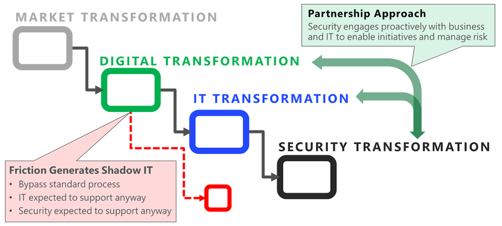
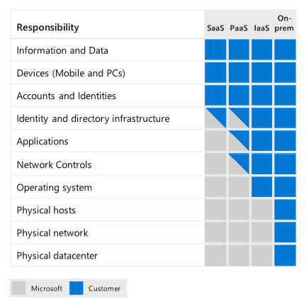
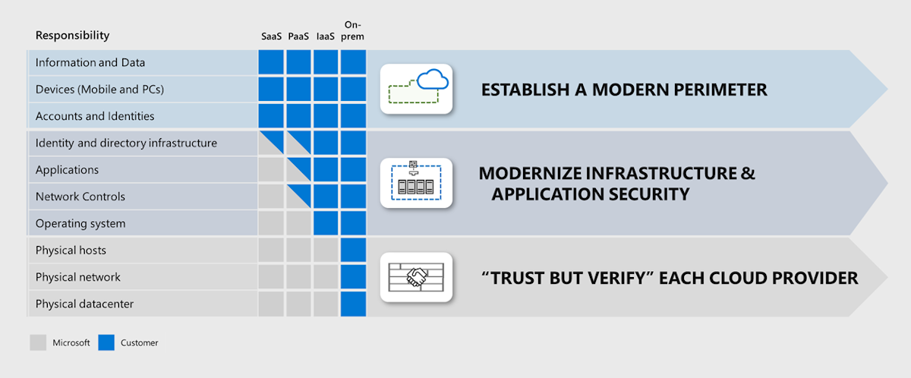
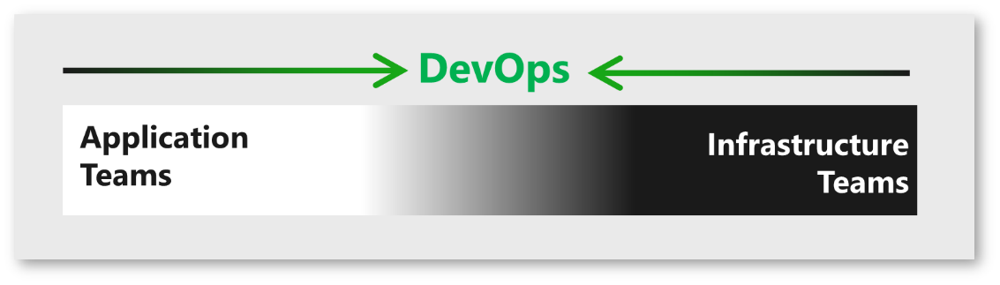
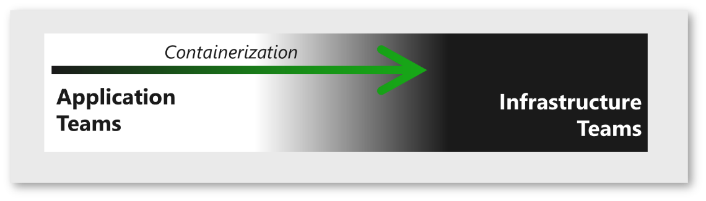
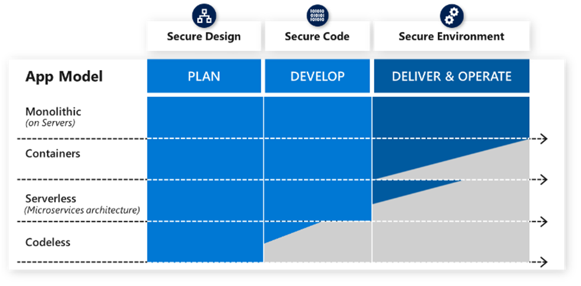

<!-- cSpell:ignore NIST CISO COVID -->

# Define a security strategy

The ultimate objectives for a security organization don't change with adoption of cloud services, but how those objectives are achieved will change. Security teams must still focus on reducing business risk from attacks and work to get confidentiality, integrity, and availability assurances built into all information systems and data.

## Modernize your security strategy

Security teams need to modernize strategies, architectures, and technology as the organization adopts cloud and operates it over time. While the size and number of changes can initially seem daunting, the modernization of the security program allows security to shed some painful burdens associated with legacy approaches. An organization may temporarily operate with legacy strategy and tooling, but this approach is difficult to sustain with the pace of change in cloud and the threat environment:

- Security teams are likely to be left out of cloud adoption decision making if they take a legacy mindset of "arms-length" security where the answer always starts with "no" (instead of working together with IT and business teams to reduce risk while enabling the business).
- Security teams will have a difficult time detecting and defending against cloud attacks if they use only legacy on-premises tooling and exclusively adhere to network perimeter only doctrine for all defenses and monitoring. Defending at cloud scale mandates the use of cloud native detection and automation capabilities and the introduction of an identity perimeter to help monitor and protect cloud and mobile assets. For more information, consult these references:
  - The [Microsoft identity platform](/azure/active-directory/develop/v2-overview) helps you incorporate modern authentication and authorization mechanisms into your applications.
  - [Azure Sentinel](/azure/sentinel/overview) provides cloud native security analytics and threat intelligence across your organization.

Because this transformation can be significant, we recommend that security teams take an agile approach to modernizing security that rapidly modernizes the most critical aspects of the strategy and then continuously improve incrementally afterwards.

### Security of the cloud and from the cloud

As your organization adopts cloud services, security teams will work toward two main objectives:

- **Security \*of\* the cloud (securing cloud resources):** Security should be integrated into the planning and operation of cloud services to ensure that those core security assurances are consistently applied across all resources.
- **Security \*from\* the cloud (using the cloud to transform security):** Security should immediately start planning and thinking about how to use cloud technologies to modernize security tools and processes, particularly natively integrated security tools. Increasingly, security tools are being hosted in the cloud and providing capabilities that are difficult or impossible to do in an on-premises environment.

Many organizations start by treating cloud resources as another *virtual datacenter*, an effective starting point for security of the cloud. As organizations modernize using security from the cloud, most will find themselves quickly outgrowing this model of thinking. Securing a software-defined datacenter using cloud-hosted tools enables capabilities beyond what on-premises models can offer:

- Rapid enablement and scaling of security capabilities.
- Highly effective asset inventory and security configuration hygiene discovery.
- Continuous assessment of the organization's security posture and controls, by deploying for example [Azure Security Center](/azure/security-center/security-center-introduction).
- Vastly improved threat detection that uses vast repositories of threat intelligence and the nearly unlimited processing and storage capabilities of the cloud, such as that enabled by [Azure Sentinel](/azure/sentinel/overview).

### The right level of security friction

Security naturally creates friction that slows down processes, it's critical to identifying which elements are healthy in your DevOps and IT processes and which are not:

- **Healthy friction:** Much like the resistance in exercise makes a muscle stronger, integrating the right level of security friction strengthens the system or application by forcing critical thinking at the right time. This typically takes the form of considering how and why an attacker may try to compromise an application or system during design (known as [threat modeling](/azure/security/develop/threat-modeling-tool)), and reviewing, identifying, and ideally fixing potential vulnerabilities an attacker can exploit in software code, configurations, or operational practices.
- **Unhealthy friction:** Impedes more value than it protects. This often happens when security bugs generated by tools have a high false positive rate (such as false alarms) or when the effort to discover or fix security issues far exceeds the potential impact of an attack.

### Standalone and integrated responsibilities

Providing confidentiality, integrity, and availability assurances requires security experts to operate dedicated security functions and work closely with other teams in the organization:

- **Unique security functions:** Security teams perform independent functions that are not found elsewhere in the organization, such as security operations, vulnerability management (such as for [virtual machines](/azure/security-center/deploy-vulnerability-assessment-vm), [containers](/azure/security-center/defender-for-container-registries-usage)), and other functions.
- **Integrating security into other functions:** Security teams also serve as subject matter experts to other teams and functions in the organization who are driving business initiatives, assessing risk, designing or developing applications, and operating IT systems. Security teams advise these teams with expertise and context on attackers, attack methods and trends, vulnerabilities that could allow unauthorized access, and options for mitigation steps or workarounds and their potential benefits or pitfalls. This function of security resembles that of a quality function as it will be woven into many places large and small in support of a single outcome.

Executing on these responsibilities while keeping up with the rapid pace of change in the cloud and the transformation of business requires security teams to modernize their tools, technologies, and processes.

## Transformations, mindsets, and expectations

Many organizations are managing a chain of multiple simultaneous transformations in the organization. These internal transformations typically start because nearly all external markets are transforming to meet new customer preferences for mobile and cloud technologies. Organizations often face the competitive threat of new startups and the digital transformation of traditional competitors who can disrupt the market.

The internal transformation process typically includes:

- **Digital transformation** of the business to capture new opportunities and stay competitive against digital native startups.
- **Technology transformation** of the IT organization to support the initiative with cloud services, modernized development practices, and related changes.
- **Security transformation** to both adapt to the cloud and simultaneously address an increasingly sophisticated threat environment.

### Internal conflict can be costly

Change creates stress and conflict, which can grind decision making to a halt. This is especially true in security where accountability for security risk is often misplaced on the subject matter experts (security teams), rather than on the owners of the assets (business owners) that are accountable for business outcomes and all other risk types. This misplaced accountability often happens because all stakeholders incorrectly view security as a technical or absolute problem to be solved, rather than a dynamic ongoing risk like corporate espionage and other traditional criminal activities.

During this time of transformation, leadership of all teams must work actively to reduce conflict that can both derail critical projects and incentivize teams to bypass security risk mitigation. Internecine conflict between teams can result in:

- **Increased security risk** such as avoidable security incidents or increased business damage from attacks (particularly when teams get frustrated by security and bypass normal processes or when outdated security approaches are easily bypassed by attackers).
- **Negative impact on the business or mission** such as when business processes aren't enabled or updated fast enough to meet market needs (often when security processes hold up key business initiatives).

It's critical to stay aware of relationship health within and between teams to help them navigate the shifting landscape that could leave valuable team members insecure and unsettled. Patience, empathy, and education on these mindsets and the positive potential of the future will help your teams better navigate this period, driving good security outcomes for the organization.

Leaders can help drive culture changes with concrete proactive steps like:

- Publicly modeling the behavior they expect of their teams.
- Being transparent about the challenges of the changes, including highlighting their own struggles to adapt.
- Regularly reminding teams of the urgency and importance of modernizing and integrating security.

### Cybersecurity resilience

Many classic security strategies have been focused solely on preventing attacks, an approach that is insufficient for modern threats. Security teams must ensure their strategy goes beyond this and also enables rapid attack detection, response, and recovery to increase resilience. Organizations must assume that attackers will compromise some resources (sometimes called *assume breach*) and work to ensure that resources and technical designs are balanced between attack prevention and attack management (rather than the typical default approach of only attempting to prevent attacks).

Many organizations are already on this journey because they have been managing the steady rise in volume and sophistication of attacks in recent years. This journey often starts with the first major incident, which can be an emotional event where people lose their prior sense of invulnerability and safety. While not as severe as a loss of life, this event can trigger similar emotions starting with denial and ultimately ending in acceptance. This assumption of "failure" may be difficult for some to accept at first, but it has strong parallels to the well-established "fail-safe" engineering principle and the assumption allows your teams to focus on a better definition of success: resilience.

The functions of the [NIST cybersecurity framework](https://www.nist.gov/cyberframework) serve as a useful guide on how to balance investments between the complementary activities of identify, protect, detect, respond, and recover in a resilient strategy.

More on cybersecurity resilience and the ultimate goals of cybersecurity controls is discussed in [How do you keep your organization's risk down](/azure/architecture/framework/security/resilience).

### How the cloud is changing security

Shifting to the cloud for security is more than a simple technology change, it's a generational shift in technology akin to moving from mainframes to desktops and onto enterprise servers. Successfully navigating this change requires fundamental shifts in expectations and mindset by security teams. Adopting the right mindsets and expectations reduces conflict within your organization and increases the effectiveness of security teams.

While these could be part of any security modernization plan, the rapid pace of change in the cloud makes adopting them an urgent priority.

- **Partnership with shared goals.** In this age of fast paced decisions and constant process evolution, security can no longer adopt an "arms-length" approach to approving or denying changes to the environment. Security teams must partner closely with business and IT teams to establish shared goals around productivity, reliability, and security and work collectively with those partners to achieve them.

  This partnership is the ultimate form of "shift left"&mdash;the principle of integrating security earlier in the processes to make fixing security issues easier and more effective. This requires a culture change by all involved (security, business, and IT), requiring each to learn the culture and norms of other groups while simultaneously teaching others about their own.

  Security teams must:

  - **Learn** the business and IT objectives and why each is important and how they are thinking about achieving them as they transform.
  - **Share** why security is important in the context of those business goals and risks, what other teams can do to meet security goals, and how they should do it.

  While not an easy task, it's essential for sustainably securing the organization and its assets. This partnership will likely result in healthy compromises where only the minimum security, business, and reliability goals may be met initially, but incrementally improve steadily over time.

- **Security is an ongoing risk, not a problem.** You can't "solve" crime. At its core, security is just a risk management discipline, which happens to be focused on malicious actions by humans rather than natural events. Like all risks, security is not a problem that can be fixed by a solution, it's a combination of the likelihood and impact of damage from a negative event, an attack. It's most comparable to traditional corporate espionage and criminal activities where organizations face motivated human attackers who have financial incentive to successfully attack the organization.

- **Success in either productivity or security requires both.** An organization must focus on both security and productivity in today's "innovation or become irrelevant" environment. If the organization is not productive and driving new innovation, it may lose competitiveness in the marketplace that causes it to weaken financially or eventually fail. If the organization is not secure and loses control of assets to attackers, it may lose competitiveness in the marketplace that causes it to weaken financially and eventually fail.

- **Nobody's perfect.** No organization is perfect at adopting the cloud, not even Microsoft. Microsoft's IT and security teams grapple with many of the same challenges that our customers do such as figuring out how to structure programs well, balancing supporting legacy software with supporting cutting edge innovation, and even technology gaps in cloud services. As these teams learn how to better operate and secure the cloud, they are actively sharing their lessons learned via documents like this along with others on the [IT showcase site](https://www.microsoft.com/itshowcase), while continuously providing feedback to our engineering teams and third-party vendors to improve their offerings.

  Based on our experience, we recommend that teams are held to a standard of continuous learning and improvement rather than a standard of perfection.

- **Opportunity in transformation.** It's important to view digital transformation as a positive opportunity for security. While it's easy to see the potential downsides and risk of this change, it's easy to miss the massive opportunity to reinvent the role of security and earn a seat at the table where decisions are made. Partnering with the business can result in increased security funding, reduce wasteful repetitive efforts in security, and make working in security more enjoyable as they will be more connected to the organization's mission.

## Adopting the shared responsibility model

Hosting IT services in the cloud splits the operational and security responsibilities for workloads between the cloud provider and the customer tenant, creating a de facto partnership with shared responsibilities. All security teams must study and understand this shared responsibility model to adapt their processes, tools, and skill sets to the new world. This will help avoid inadvertently creating gaps or overlaps in your security posture resulting in security risks or wasted resources.

This diagram illustrates how security responsibilities will be distributed between cloud vendors and cloud customer organizations in a de facto partnership:

As there are different models of cloud services, the responsibilities for each workload will vary depending on whether it's hosted on software as a service (SaaS), platform as a service (PaaS), infrastructure as a service (IaaS), or in an on-premises datacenter.

## Building security initiatives

This diagram illustrates the three primary security initiatives that most security programs should follow to adjust their security strategy and security program goals for the cloud:

Building a resilient security posture in the cloud requires several parallel complementary approaches:

- **Trust but verify:** For responsibilities performed by the cloud provider, organizations should take a "trust but verify" approach. Organizations should evaluate the security practices of their cloud providers and the security controls they offer to ensure the cloud provider meets the security needs of the organization.

- **Modernize infrastructure and application security:** For technical elements under the organization's control, prioritize modernizing security tooling and associated skill sets to minimize coverage gaps for securing resources in the cloud. This is composed of two different complementary efforts:

  - **Infrastructure security:** Organizations should use the cloud to modernize their approach to protecting and monitoring the common components used by many applications, such as operating systems, networks, and container infrastructure. These cloud capabilities can often including managing infrastructure components across both IaaS and on-premises environments. Optimizing this strategy is important because this infrastructure is a dependency of the applications and data that run on it, which often enable critical business processes and store critical business data.

  - **Application security:** Organizations should also modernize the way they secure the unique applications and technology that is developed by or for their organization. This discipline is changing rapidly with the adoption of agile DevOps processes, the increasing use of open-source components, and introduction of cloud APIs and cloud services to replace application components or interconnect applications.

    Getting this right is critical because these applications often enable critical business processes and store critical business data.

  - **Modern perimeter:** Organizations should have a comprehensive approach for protecting data across all workloads, organizations should establish a modern perimeter of consistent, centrally managed identity controls to protect their data, devices, and accounts. This is heavily influenced by a zero trust strategy discussed in detail in [Module 3 of the CISO workshop](/security/ciso-workshop/ciso-workshop-module-3).

### Security and trust

The use of the word *trust* in security can be confusing. This documentation refers to it in two ways that illustrate useful applications of this concept:

- [Zero trust](https://www.microsoft.com/security/business/zero-trust) is a common industry term for a strategic approach to security that assumes a corporate or intranet network is hostile (worthy of *zero trust*) and designs security accordingly.
- [Trust but verify](https://www.emazzanti.net/wp-content/uploads/2017/11/Trust-but-verify-Article-PDF.pdf) is an expression that captures the essence of two different organizations working together toward a common goal despite having some other potentially divergent interests. This concisely captures many of the nuances of the early stages of partnering with a commercial cloud provider for organizations.

A cloud provider and its practices and processes can be accountable to meet contractual and regulatory requirements and could earn or lose trust. A network is a nonliving connection that cannot face consequences if it's used by attackers (much like you cannot hold a road or a car accountable for criminals using them).

## How cloud is changing security relationships and responsibilities

As with previous transitions to a new generation of technology like desktop computing and enterprise server computing, the shift to cloud computing is disrupting long-established relationships, roles, responsibilities, and skill sets. The job descriptions we have become accustomed to over the last few decades do not cleanly map to an enterprise that now includes cloud capabilities. As the industry collectively works to normalize a new model, organizations will have to focus on providing as much clarify as possible to help manage the uncertainty of ambiguity during this period of change.

Security teams are affected by these changes in the business and technology they support as well as their own internal modernization efforts to better orient to threat actors. Attackers are actively evolving to constantly search for the easiest weak points to exploit in the people, process, and technology of the organization and security must develop capabilities and skills to address these angles.

This section describes the key relationships that frequently change on the journey to the cloud, including lessons learned on minimizing risk and embracing the opportunities to improve:

- **Between security and business stakeholders:** Security leadership will need to increasingly partner with business leaders to enable organizations to reduce risk. Security leaders should support business decision making as security subject matter expert (SMEs) and should strive to grow into trusted advisors to these business leaders. This relationship will help ensure business leaders consider security risks while making business decisions, inform security of business priorities, and help ensure security investments are prioritized appropriately alongside other investments.

- **Between security leadership and team members:** Security leadership should take these insights from business leadership back to their teams to guide their investment priorities.

  By setting a tone of cooperation with business leaders and their teams rather than a classic "arms-length" relationship, security leaders can avoid an adversarial dynamic that impedes both security and productivity goals.

  Security leaders should strive to provide clarity to their team on how to manage their daily decisions on productivity and security tradeoffs as this may be new to many on their teams.

- **Between application and infrastructure teams (and cloud providers):** This relationship is undergoing significant changes because of multiple trends in the IT and security industry aimed at increasing innovation speed and developer productivity.

  The old norms and organizational functions have been disrupted, but new norms and functions are still emerging, so we recommend accepting the ambiguity, keeping up with current thinking, and experiment with what works for your organizations until it does. We don't recommend adopting a wait-and-see approach in this space because it might put your organization at a major competitive disadvantage.

  These trends are challenging the traditional norms for roles and relationships of applications and infrastructure:

  - **DevOps-fusing disciplines:** In its ideal state, this effectively creates a single highly functional team that combines both sets of subject matter expertise together to rapidly innovate, release updates, and resolve issues (security and otherwise). While this ideal state will take some time to achieve and the responsibilities in the middle are still ambiguous, organizations are already reaping some benefits of rapid releases because of this cooperative approach. Microsoft recommends integrating security into this cycle to help learn those cultures, share security learnings, and work toward a common goal of rapidly releasing secure and reliable applications.

  

  - **Containerization becoming a common infrastructure component:** Applications are increasingly being hosted and orchestrated by technologies like Docker, Kubernetes, and similar technologies. These technologies simplify development and release by abstracting many elements of the setup and configuration of the underlying operating system.

  

  While containers began as an application development technology managed by development teams, it's becoming a common infrastructure component that is increasingly shifting to infrastructure teams. This transition is still in progress at many organizations, but it's a natural and positive direction many of the current challenges will be best solved with traditional infrastructure skill sets like networking, storage, and capacity management.

  Infrastructure teams and security team members that support them should be provided with training, processes, and tooling to help manage, monitor, and secure this technology.

  - **Serverless and cloud application services:** One of the dominant trends in industry right now is reducing the amount of time and development work required to build or update applications.

    

    Developers are also increasingly using cloud services to:

    - Run code instead of hosting applications on virtual machines (VMs) and servers.
    - Provide application functions instead of developing their own components. This has led to a *serverless* model that uses existing cloud services for common functions. The number and variety of cloud services (and their pace of innovation) has also exceeded the ability of security teams to evaluate and approve the use of those services, leaving them to choose between allowing developers to use any service, attempting to prevent the development teams from using unapproved services, or trying to find a better way.
    - **Codeless applications and Power Apps:** Another emerging trend is the use of codeless technologies like Microsoft Power Apps. This technology enables people without coding skills to create applications that achieve business outcomes. Because of this low friction and high value potential, this trend has the potential to rise in popularity quickly and security professionals would be wise to rapidly understand its implications. Security efforts should be focused on the areas where a human could make a mistake in the application, namely the design of the application and asset permissions via threat modeling the application components, interactions/relationships, and role permissions.

- **Between developers and open-source component authors:** Developers are also increasing efficiency by using open-source components and libraries instead of developing their own components. This brings value through efficiency, but also introduces security risks by creating an external dependency and a requirement to properly maintain and patch those components. Developers are effectively assuming the risk of security and other bugs when they use these components and have to ensure there is a plan to mitigate them at the same standards as code they would develop.

- **Between applications and data:** The line between security of data and applications is becoming blurred in places and new regulations are creating a need for closer cooperation between data/privacy teams and security teams:

  - **Machine learning algorithms:** Machine learning algorithms are similar to applications in that they are designed to process data to create an outcome. The key differences are:

    - **High-value machine learning:** Machine learning often confers a significant competitive advantage and is often considered sensitive intellectual property and a trade secret.

    - **Sensitivity imprint:** Supervised machine learning is tuned using data sets, which imprints characteristics of the dataset on the algorithm. Because of this, the tuned algorithm may be considered sensitive because of the dataset used to train it. For example, training a machine learning algorithm to find secret army bases on a map using a dataset of secret army bases would make it a sensitive asset.

    > [!NOTE]
    > Not all examples are obvious, so it's critical to bring a team together with the right stakeholders from data science teams, business stakeholders, security teams, privacy teams, and others. These teams should have a responsibility to meet common goals of innovation and responsibility. They should address common issues such as how and where to store copies of data in insecure configurations, how to classify algorithms, as well as any concerns of your organizations.
    >
    > Microsoft has published our [principles of responsible AI](https://www.microsoft.com/ai/responsible-ai) to guide our own teams and our customers.

    - **Data ownership and privacy:** Regulations like GDPR have increased the visibility of data issues and applications. Application teams now have the ability to control, protect, and track sensitive data at a level comparable to tracking financial data by banks and financial institutions. Data owners and applications teams need to build a rich understanding of what data applications store and what controls are required.

- **Between organizations and cloud providers:** As organizations host workloads in the cloud, they are entering into a business relationship with each of those cloud providers. The use of cloud services often brings business value such as:

  - **Accelerating digital transformation initiatives** by reducing time to market for new capabilities.

  - **Increasing value of IT and security activities** by freeing teams to focus on higher value (business-aligned) activities rather than lower-level commodity tasks that are provided more efficiently by cloud services on their behalf.

  - **Increased reliability and responsiveness:** Most modern clouds also have high uptime compared to traditional on-premises datacenters and have shown they can scale rapidly (such as during the COVID-19 pandemic) and provide resiliency following natural events like lightning strikes (which would have kept many on-premises equivalents down for much longer).

    While beneficial, this shift to the cloud is not without risk. As organizations adopt cloud services, they should consider potential risk areas including:

  - **Business continuity and disaster recovery:** Is the cloud provider financially healthy with a business model that's likely to survive and thrive during your organization's use of the service? Has the cloud provider made provisions to allow customer continuity if the provider experiences financial or other failure, such as providing their source code to customers or open-sourcing it?

    For more information and documents regarding Microsoft's financial health, see [Microsoft investor relations](https://www.microsoft.com/investor).

  - **Security:** Does the cloud provider follow industry best practices for security? Has this been validated by independent regulatory bodies?

    - [Microsoft Cloud App Security](/cloud-app-security/risk-score) allows you to discover usage of over 16,000 cloud applications, which are ranked and scored based on more than 70 risk factors to provide you with ongoing visibility into cloud use, shadow IT, and the risk that shadow IT poses to your organization.
    - The [Microsoft Service Trust Portal](https://servicetrust.microsoft.com) makes regulatory compliance certifications, audit reports, pen tests, and more available to customers. These documents include many details of internal security practices (notably the SOC 2 Type 2 report and FedRAMP Moderate system security plan). [Azure Security Center](/azure/security-center/tutorial-security-policy) allows the [management of security policies](/azure/security-center/tutorial-security-policy) and can indicate the level of compliance with predefined industry and regulatory standards.

  - **Business competitor:** Is the cloud provider a significant business competitor in your industry? Do you have sufficient protections in the cloud services contract or other means to protect your business against potentially hostile actions?

    Review [this article](https://www.cnbc.com/2019/03/16/why-volkswagen-chose-microsoft-azure-over-aws.html) for commentary on how Microsoft avoids competing with cloud customers.

  - **Multicloud:** Many organizations have a de facto or intentional multicloud strategy. This could be an intentional objective to reduce reliance on a single supplier or to access unique best of breed capabilities, but can also happen because developers chose preferred or familiar cloud services, or your organization acquired another business. Regardless of the reason, this strategy can introduce potential risks and costs that have to be managed including:

    - **Downtime from multiple dependencies:** Systems architected to rely on multiple clouds are exposed to more sources of downtime risk as disruptions in the cloud providers (or your team's use of them) could cause an outage/disruption of your business. This increased system complexity would also increase the likelihood of disruption events as team members are less likely to fully understand a more complex system.
    - **Negotiating power:** Larger organizations also should consider whether a single-cloud (mutual commitment/partnership) or multicloud strategy (ability to shift business) will achieve greater influence over their cloud providers to get their organization's feature requests prioritized.
    - **Increased maintenance overhead:** IT and security resources already are overburdened from their existing workloads and keeping up with the changes of a single cloud platform. Each additional platform further increases this overhead and takes team members away from higher value activities like streamlining technical process to speed business innovation, consulting with business groups on more effective use of technologies, and so on.
    - **Staffing and training:** Organizations often do not consider the staffing requirements necessary to support multiple platforms and the training required to maintain knowledge and currency of new features which are released in a rapid pace.
