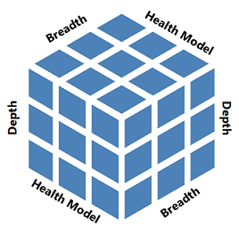
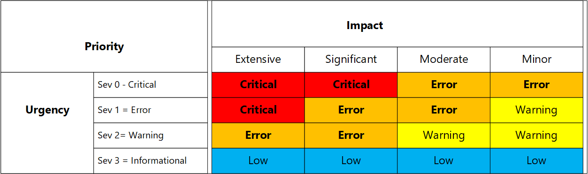
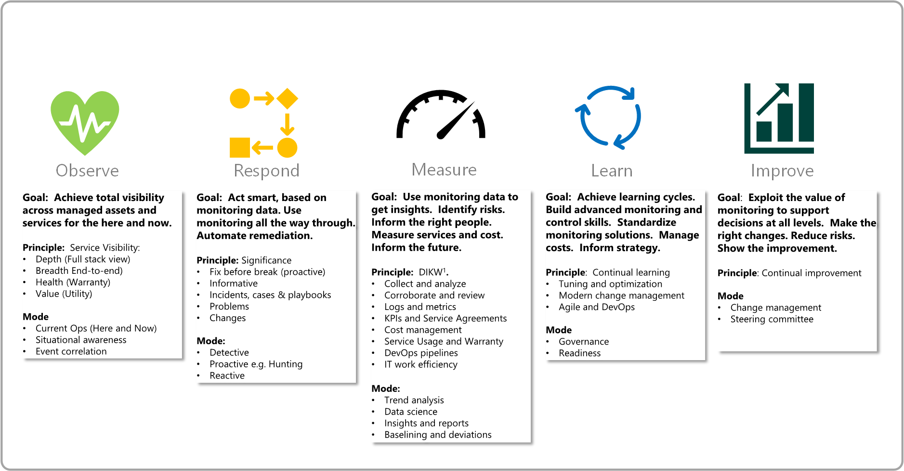

<!-- cSpell:ignore DIKW Nagios Zabbix -->

# Cloud monitoring guide: Formulate a monitoring strategy

As you undergo your digital transformation to the cloud, it's important that you plan and develop an effective cloud monitoring strategy with participation of developers, operations staff, and infrastructure engineers. The strategy should be growth-oriented, defined minimally, then refined iteratively; always aligned with business needs. Its outcome delivers an agile operations modality centered around the ability of the organization to proactively monitor complex distributed applications the business depends on.

## Where to start?

To ease your journey to the cloud, use the [strategizing](./index.md) and the [planning](../plan/index.md) phase of the Cloud Adoption Framework. Monitoring influences and justifies the motivations, business outcomes, and initiatives. Include monitoring during strategizing and planning phases, your initiatives, and projects. For example, examine how the first adoption project establishes early operations management in Azure. Imagine what the cloud operating model needs to look like, including the role of monitoring. Monitoring is best served with a service-based approach, as an operations function, where monitoring is an advisory service and a provider of expertise to business and IT consumers.

The following are important areas that strongly influence a sound monitoring strategy:

- Monitor the health of your applications, based on its components and their relationship with other dependencies. Start with the cloud service platform, resources, the network, and lastly the application by collecting metrics and logs where applicable. For the hybrid cloud model, include on-premises infrastructure and other systems the application relies on.

- Include measuring the end user's experience in your applications performance monitoring plan by mimicking your customer's typical interactions with the application.

- Ensure security requirements correspond with your organizations security compliance policy.

- Align alerts with what is considered a relevant and practical incident (such as warnings and exceptions) and align severity with its significance following your incident priority and urgency escalation matrix.

- Collect only the metrics and logs that are useful, measurable, and identifiable to the business and IT organization.

- Define an integration plan with existing ITSM solutions such as remedy or ServiceNow for incident generation or upstream monitoring. Determine which alerts should be forwarded, whether alert enrichment is required to support specific filtering requirements, and how to configure.

- Understand who needs visibility, what they need to see, and how it should be visualized based on their roles and responsibilities.

At the heart of operations management, your IT organization needs to establish centralized governance and strict delegation over approaches to build, operate, and manage IT services.

### Initial strategy goals

As an architect or strategic planner, you may need to formulate an early strategy for operations management, in which monitoring plays a major role. Consider these four outcomes:

1. Manage cloud production services when they go live into production, such as networking, applications, security and virtual infrastructure.

2. Apply limited resources to rationalize your existing monitoring tools, skills and expertise, and use cloud monitoring to reduce complexity.

3. Make your monitoring solution processes more efficient, work faster and smoother, at scale and be able to change quickly too.

4. Account for how your organization will plan for and host monitoring based on cloud models. Work toward the goal of reducing your requirements as the organization transitions from IaaS to PaaS, and then to SaaS.

## Determine what you have

As a manageability expert, you may be working closely with a steering committee, an architect, and strategic planners. You might be working to formulate your monitoring strategy by assessing the current state of your systems management, including: the people, partners, outsourcing, tooling, complexity, gaps, and risks. An assessment will help you prioritize the set of found problems and select the key opportunities that improve the current situation. Determine also, the services, systems, and data that are likely to remain on-premises as one important outcome. Ideally, management wants a roadmap of initiatives, but in direct proportion to the known planning horizon. Discussing unknowns, are as important.

## High-level modeling

As the business determines what services to move, you need to invest your resources carefully. On-premises, you own all responsibilities for monitoring and are heavily invested. The moves made toward SaaS services, for example, do not eliminate your monitoring responsibility. You'll decide who needs access, who gets alerts, and who needs access to analytics at a minimum. [Azure Monitor](/azure/azure-monitor/) and [Azure Arc](https://azure.microsoft.com/services/azure-arc/) are Azure services with the flexibility of addressing monitoring scenarios across all four cloud models, not just resources inside Azure. Look beyond the common cloud models as shown below. If you're using Microsoft Office applications delivered by [Microsoft 365](/microsoft-365/) services in your organization, you'll need to include security and compliance monitoring with Microsoft 365 in addition to [Azure Security Center](/azure/security-center/). This includes identities, endpoint management, and device monitoring outside of your corporate network.

## Monitoring informs strategy

Consider where early monitoring capability *informs strategy*. Many decisions depend on early monitoring data in order to build a capability roadmap that guides limited resources and adds confidence. Strategies also need real-world input from monitoring of service enablement.

Consider the role monitoring plays in strategies to incrementally protect and secure the digital estate:

- Activity logs and security monitoring are needed to measure directory usage and external sharing of sensitive content, to inform in an incremental approach to layer on protective features and achieve the right balance with privacy monitoring.

- Policies and baselines will inform the rationalization objective (migrate, lift and shift, or rearchitect) and improve confidence that data and information can be migrated from on-premises to cloud services.

Later in this guide, discover some common monitoring scenarios or use cases that will help accelerate adoption.

## Formulate a monitoring architecture

Define your current and future architecture of systems management that includes monitoring, to:

- Apply limited resources in consolidating your monitoring investment.

- Decide how monitoring will help enable the future services your business needs: cloud monitoring of highly scalable, resilient, and globally aware cloud services.

- Align monitoring to the future services and resources that you will be monitoring in the cloud.

- Identify monitoring gaps across the three dimensions (depth, breadth, and across) of the health model.

- Model the financial aspects, costs, and support factors that support a cost-benefit analysis.

- Guide the hybrid decisions that you need to make.

One principle of monitoring is service visibility. For a service, asset or component to be fully visible, you need to balance the three sides of this principle, which are:

1. Monitoring in-depth by collecting meaningful and relevant signals.
2. Monitor end-to-end or breadth from the lowest layer of the stack up to the application.
3. East to west with a focus on its aspects of health (availability, performance, security, and continuity).

Some key questions include:

- How will you shape security logs and secure their access back to security and new privacy controls?

- Which services will be globally available and as such, can be globally monitored at the service edge?

- What about the network points between your network infrastructure, and network connectivity to service and application endpoints that tells us when it's us or the cloud provider?

- What are the boundaries of security operations versus health and performance? How can we provide summaries of health and status to security operations, and the converse, back to service owners?

To assemble this architecture, here are several considerations:

- A dataflow approach starting from service assets and going up the stack: metrics and log data emitted by infrastructure, IoT devices, mobile devices, and others. Are all of the items under management-to-monitoring tools (mid-tier)? Move upward and outward (ITSM tools, global monitoring, security information and event management (SIEM), custom alert enrichment, and others).

- Whether to continue with [System Center Operations Manager](/system-center/scom/welcome) or other monitoring tools.

- The economic cost.

- How the business will use logs and metrics. Azure Monitor brings a significant volume of log and time-series data to the performance and health side of monitoring, similar to what security operations experiences. Logs and metrics are two major data components of the Azure Monitor architecture. The reasons why this is important:

   1. Since you can build large-scale complex cloud services, your problem management costs are reduced to analyze, correlate, and determine causes of problems in one place reducing the need to access resources directly, thereby improving security.

   2. Similar to a SIEM, Azure Monitor is consolidating machine data directly from on-premises assets and Azure resources (including activity logs, tenant and subscription data, and any log data from a REST client), and provides a simple query language to provide data analysis far beyond what was possible before.

Consider your data flows and tools:

- Sources and types (telemetric, traces, stateful, time series).

- Tools and suites (rows): (Columns: availability, capacity, security, continuity, and compliance).

- The role of global monitoring or the top-tier.

- The role of IT service management (ITSM) integration to trigger on significant events.

Consider a single policy in your governance plan for event significance, throughout your enterprise, to drive alerting and notifications. It's one of the key policies in your monitoring strategy. The following table is an example of incident management priority model to standardize events, significance, and alerting used for notifications.

## Formulate initiatives

As a monitoring expert or systems administrator, you've discovered that cloud monitoring is faster and easier to establish, leading to inexpensive demos or proofs-of-value. To overcome the tendency to stay in demo mode, you need to stay in constant touch with strategy and be able to execute on production-focused monitoring plans. Because strategy has plenty of uncertainty and unknowns, you won't know all of the monitoring requirements in advance. Therefore, decide on the first set of adoption plans, based on what is minimally viable to the business and IT management. You can refer to this capability as *that which is needed to begin the journey*. Here are two example initiatives that help declare forward motion:

- **Initiative 1:** To reduce the diversity and complexity of our current monitoring investment, we will invest in establishing a core capability using Azure Monitor first, given the same skills and readiness applies to other areas of cloud monitoring.

- **Initiative 2:** To decide on how we use our license plans for identity, access, and overall information protection, we will help the security and privacy offices establish early activity monitoring of users and content as they migrate to the cloud, to clarify questions on classification labels, data loss prevention, encryption, and retention policies.

### Consider scale

Consider scale in your strategy and who will be defining and standardizing *monitoring as code*. Your organization should plan to build standardized solutions using a combination of tools such as:

- Azure Resource Manager templates.
- Azure Policy monitoring initiative definitions and policies.
- GitHub to establish a source control for the scripts, code, and documentation.

### Consider privacy and security

In Azure, you'll need to secure certain monitoring data emitted by resources and the control plane actions that are logged in Azure, known as activity logs. Additionally, specialized logs that record user activity such as the Azure Active Directory sign-in and audit logs, and if integrated, the Microsoft 365 unified audit log, as they contain sensitive data that may need to be protected under privacy laws.

Your monitoring strategy should include these components:

- Separate non-monitoring data from monitoring data
- Restrict access to resources

### Consider business continuity

Azure Monitor collects, indexes, and analyzes real-time machine and resource-generated data to support your operations and help drive business decisions. Under rare circumstances, it's possible that facilities in an entire region can become inaccessible, for example due to network failures. Or facilities can be lost entirely, for example due to a natural disaster. By relying on these services in the cloud, your planning isn't focused around infrastructure resiliency and high availability, rather its planning for:

- Availability for data ingestion from all your dependent services and resources in Azure, resources in other clouds, and from on-premises.
- Data availability for insights, solutions, workbooks and other visualizations, alerting, integration with ITSM, and other control plane services in Azure supporting your operational requirements.

Create a recovery plan, and make sure that it covers data restoration, network outages, dependent service failures, and region-wide service disruptions.

### Consider maturity

Maturity is an important consideration in your monitoring strategy. We recommend you start minimally, gather data and with this information, determine the strategy. The first monitoring solutions you'll want are those that ensure observability, to include responsive processes, such as incident and problem management. Here, you will:

- Create one or more Log Analytics workspaces

- Enable agents

- Enable resource diagnostic settings

- Enable initial alert rules

Over time, you gain confidence in Azure Monitor capabilities with the need to measure health indicators, so this involves expanding the focus on the collection of logs, enabling and using insights and metrics, and defining log search queries that drive the measurement and calculation of what is healthy or unhealthy.

Learning cycles includes getting monitoring data and insights into the hands of managers, and ensuring the right consumers have monitoring data they need. Learning cycles include continual tuning and optimizing of your initial monitoring plans to adapt, to improve service, and inform adoption plans.

<!-- docutune:ignore "Data to Information, Knowledge, and Wisdom" -->

1 The dikw model is an often used method, with roots in knowledge management, to explain the ways we move from Data to Information, Knowledge, and Wisdom with a component of actions and decisions.

Monitoring is foundational for services you build in Azure. Your strategy can address these four disciplines of modern monitoring, to help you define minimum viable monitoring, and gain confidence in steps. Moving your capability from reactive to proactive and scaling its reach to end users is but one goal.

- **Observe:** First, you should focus on establishing monitoring to observe the health and status of Azure services and resources. Configure basic monitoring and then automate with Azure Policy and Azure Resource Manager templates, to establish initial visibility of services and their warranty: availability, performance or capacity, security, and configuration compliance. For example, based on minimum viable setup of Azure Monitor, configure resources for monitoring and diagnostics, set up alerts, and insights. Include knowledge and readiness of monitoring consumers, defining and triggering from events, for service work such as incidents and problems. One indicator of maturity is how much can be automated to reduce unnecessary human costs to manually observe health and status. Knowing which services are healthy is as important as being alerted on services that are unhealthy.

- **Measure:** Configure collection of metrics and logs from all resources to monitor for symptoms/conditions that are issues, which indicate potential or actual impact to the availability of the service, or impact of the consumers of the service/application. For example:

  - When using a feature in the application, is it showing response time latency, returning an error when I selected something, or unresponsive?

  - Ensure services are meeting service agreements by measuring the utility of the service or application.

- **Respond:** Based on the context of known issues to observe and measure, evaluate what qualifies as a bug, autoremediation, or requires manual response based on what is classified as an incident, problem, or change.

- **Learn and improve:** Providers and consumers participating in learning cycles implies consuming actual monitoring data through insights, reports and workbooks, to continually improve the target service and to enact tuning and optimization of the monitoring configuration. Change is important too, that the monitoring configuration is changing in tandem with changes to the service (such as new, modified, or retired) and continues to match the actual service warranty.

To help you align monitoring plans to strategy, use the following table to categorize the different monitoring scenarios that occur in more detail. This works with the five Rs of rationalization introduced earlier during the planning phase. If you're using System Center Operations Manager, you have hybrid and cloud options available to rationalize your investment.

| Type | Monitoring objective | Example objective |
|-----|---------------------|------------------|
| 1 | Only on-premises | System Center Operations Manager. Continue to monitor services, infrastructure, networking up the application layer in owned datacenters with no cloud considerations. |
| 2 | On-premises to the cloud | Continue using System Center Operations Manager, and apply the Microsoft 365 and Azure management packs. |
| 3 | On-premises to/with cloud (cooperative) where services run in both the cloud and on-premises | Establish initial monitoring with Azure Monitor. Connect Azure Monitor to System Center Operations Manager and alert sources, such as Zabbix or Nagios. Deploy Azure Monitor monitoring agents, multihoming with System Center Operations Manager where they monitor cooperatively. |
| 4 | Hybrid migration | Monitor the migration, for example, Microsoft Exchange Server to Microsoft 365 Exchange Online. Exchange Online service health and service usage, security and compliance, all from Microsoft 365. Gradually decommission monitoring exchange on-premises with System Center Operations Manager until migration is complete. |
| 5 | Hybrid forever | System Center Operations Manager, Azure AD, Azure Monitor, Azure Security Center, Intune, and others; a range of tools for a mixture of digital assets. |
| 6 | Cloud native | Azure Monitor, Azure Policy, Azure Security Center, Microsoft 365, Azure Service Health, Azure Resource Health, and others. |
| 7 | Multicloud owned tenants (consolidate) | Centralize the monitoring of many tenants. Azure Lighthouse, Azure Policy, Azure Monitor, and Azure Sentinel. |
| 8 | Multicloud ecosystem | Centralize the monitoring of different cloud providers: Microsoft, Amazon, Google, and others. |
| 9 | Provider > consumer | Monitoring solutions and services as a cloud provider. |

## Formulate monitoring requirements

As you progress through this process, your strategy reveals there may be much to do in the end. Ultimately your mindset extends outside the corporate network into the workplace, to devices and endpoints, and further outward to the identity-as-security boundary. The new edge defined with cloud monitoring is a strong motivator in contrast with a datacenter and workplace mindset.

You can use Azure now to gradually begin managing all or some aspects of your on-premises resources, even for services you'll keep on-premises. You also want strategy to define your monitoring boundaries of responsibility in alignment with the business' cloud adoption strategy, based on the cloud service model your business adopts. Even for services based on IaaS, you'll get metrics, logs, views, and alerting capabilities through Azure Service Health and here, you'll configure alerts from availability monitoring of your Azure resources with resource health. With SaaS services, such as Microsoft 365, much is already provided, and you need to configure appropriate access to portals, dashboards, analytics, and alerts. From a service perspective, a large service with distributed components such as Microsoft 365 Exchange Online have many objectives, not just the need to observe its health and status.

| Primary objective | Goal and outcome |
|-------------------|------------------|
| Health and status monitoring | Holistically observe, measure, learn, and improve the long-term warranty of the service or component, including service levels, in these aspects taken together: availability, capacity, performance, security, and compliance. A healthy system, service or component is online, performing well, secure and compliant. Health monitoring includes logs and is stateful with real-time health states and metrics. It also includes trending reports, insights, and trends focused on service usage. |
| Utility monitoring | Observe, measure, learn, and improve the quality or qualitative aspects of how a system delivers value. User experience is one type of monitoring use case. |
| Security monitoring | Observe, measure, learn, and improve protection in support of cybersecurity strategy and functions such as security operations, identity and access, information protection, privacy, threat management and compliance. Monitor using Azure Security Center and Azure Sentinel, and Microsoft 365. |
| Cost monitoring | Monitor usage and estimate costs using Azure Monitor and Azure Cost Management + Billing as a new primary objective. The Azure Cost Management + Billing APIs allow you to explore cost and usage data using multidimensional analysis. |

| Tertiary objectives | Goal and outcome |
|---------------------|------------------|
| Activity monitoring | Observe, measure, learn, and improve usage, security, and compliance from sources such as Azure activity logs, audit logs, and the Microsoft 365 unified audit log for subscription level events, actions on resources, user and administrator activity, content, data, and for your security and compliance needs in Azure and Microsoft 365. |
| Service usage | Service owners want analytics and insights to measure, learn, and improve the usage of Azure and Microsoft 365 services (IaaS, PaaS, SaaS) with service usage reports, analytics, and insights. Ensure plans include who will need access to the admin portals, dashboards, insights, and reports. |
| Service and resource health | Observe the health of your cloud resources, and service outages and advisories from Microsoft, to stay informed about incidents and maintenance. Include resource health in monitoring of the availability of your resources and alert on changes in availability. |
| Capacity and performance monitoring | In support of health monitoring, your needs may require more depth and specialization. |
| Change and compliance monitoring | Observe, measure, learn, and improve configuration management of resources, which should now include security in the formulation, influenced by good use of Azure Policy to standardize monitoring configurations and enforce security hardening. Log data to filter on key changes being made on resources. |
| Identity and access monitoring | Observe, measure, learn, and improve both the usage and security of Active Directory, Azure Active Directory, and identity management that integrates users, applications, devices, and other resources no matter where they are. |
| Information protection | Not only Azure Monitor, but Azure Information Protection depending on the plan, includes usage analytics critical to your development of a robust information protection strategy across Azure and Microsoft. |
| Privacy monitoring | Organizations face expanding privacy needs to include information protection of the digital estate, data classification, and data loss prevention to mitigate risks to privacy breaches and infractions. Microsoft 365 information protection includes monitoring capabilities that can also be integrated with Azure Monitor. |
| Threat management and integrated threat protection | The cloud brings together the separate, traditional roles of security monitoring with health monitoring. Integrated threat protection, for example, involves monitoring to accelerate an optimal state of zero trust. Integrating Microsoft Defender for Identity allows a migration from using System Center Operations Manager to monitor Active Directory, and integrate your Active Directory security-related signals to detect advanced attacks in hybrid environments. |

## Agile solution releases

Ultimately, you'll deliver monitoring configurations or solutions into production. As an IT Operations Manager or monitoring team lead, consider a standard, simple taxonomy to improve communication with consumers, managers, and IT operations. An agile DevOps approach ensures monitoring is embedded within the teams who will be building and operating cloud services. While traditional project management works, it's not fast enough nor typically accepted as a standard practice by operations teams.

Include in your strategy and operating model how you communicate monitoring plans, objectives, and configurations (the solutions). For example, how you might use Azure Boards:

| Agile term | What to include | Examples |
|----------|---------------|--------|
| Epics | Broad monitoring   Initiatives of the monitoring strategy | Consolidate Azure cloud monitoring   Hybrid cloud monitoring   Private cloud monitoring   Establish core monitoring service |
| Features | Individual monitoring   Plans and projects | Monitoring requirements   Monitoring consumers and providers   Objectives   Tools   Schedule |
| User stories and tasks | The end result is a monitoring configuration or solution | Network monitoring (for example, ExpressRoute)   Standardized IaaS VM monitoring (for example Azure Monitor for VMs, Application Insights, Azure Policy, settings, policies, reports, workspaces.) |

## Establish minimum governance

As early as possible, establish how you intend to govern your cloud monitoring investment. Remember that Azure Monitor is a *tenant* service with visibility across management groups and subscriptions, and users can be scoped to limit their actions with Azure role-based access control.

Define who will have what level of access in Azure to support their role and responsibility. We recommend you to set Reader role access for monitoring consumers as early as possible and then start controlling who are granted the Contributor role.

First, identify the roles who will own and manage resource groups in Azure as part of your governance framework:

- Whether a monitoring team or one or more administrators of resources and resource groups will have privileged access to the Monitoring Contributor role.

- The consumers who should be granted the Monitoring Reader role, which enables access to features in Azure Monitor, as well as investigate issues within the monitoring section that is included with each Azure resource.

- Which managers require access to other Azure reader roles, such as the Reports Reader role.

In summary, your monitoring consumer roles probably need broad access, versus your developers and system administrators who only need role-based access to certain Azure resources. As another restriction, ensure you exempt readers from access to sensitive monitoring data such as security, sign-in, and user activity logs.

## Establish readiness

Early on, formulate a readiness plan to help your IT staff adopt new skills, practices, and techniques for cloud monitoring in Azure. Consider the [skills readiness guidance](./suggested-skills.md) for monitoring that includes foundational needs, as well as those specific to monitoring.

## Next steps

> [!div class="nextstepaction"]
> [Observability](../manage/monitor/observability.md)
