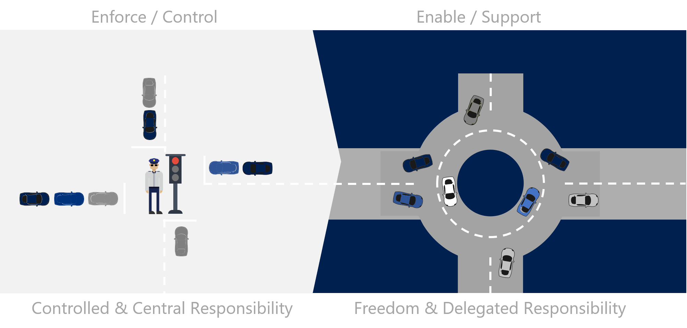

# Required cloud functions

For larger companies and enterprises, it's common to have various teams and functions that are involved in the cloud adoption journey. These teams and functions are typically responsible for different aspects of the cloud adoption journey, and they work together to ensure that the cloud adoption projects are successful, from strategy to delivery.

- For _startups and smaller_ organizations, some of these functions might be combined or handled by a single team.
- For _enterprises and large_ organizations, these functions might be split into multiple teams or departments.

> [!NOTE]
> Some suggested functions might only be relevant in later stages of the cloud adoption journey. Come back to this list as you progress through the cloud adoption methodologies in the Cloud Adoption Framework.

The following suggested cloud functions are based on the Cloud Adoption Framework for Azure. These functions are typically involved in a cloud adoption journey, but the specific functions and roles can vary depending on the organization.

## Cloud strategy functions

A cloud strategy team defines motivations and business outcomes for cloud adoption. This team is responsible for ensuring that the cloud adoption strategy is aligned with the business strategy and that the cloud adoption efforts are focused on achieving the desired business outcomes.

**Roles:**

Typically, the following roles provide cloud strategy functions. When you define your cloud strategy team, be sure it includes a diverse set of skills and experiences to ensure that all aspects of the cloud adoption journey are covered:

- Finance
- Line of business
- Human resources
- Operations
- Enterprise architecture
- IT infrastructure
- Application groups
- Project managers

**Responsibilities:**

- _Primary focus_. Validate and maintain alignment between business priorities and cloud adoption efforts.
- _Secondary focus_. Focus on change management across the adoption efforts.

Ideally, the cloud strategy team delivers on the following tasks.

Typical responsibilities include:

- Establish clear [motivations and objectives](../mission-objectives.md) for cloud adoption.
- Review and [inform your strategy](../inform/index.md) on business outcomes and financial models in alignment with business objectives.
- Develop and maintain a [cloud adoption strategy](../index.md) and roadmap

## Cloud adoption/migration functions

The primary need from any cloud adoption function is the timely, high-quality implementation of the technical solutions outlined in the adoption plan. These solutions should align with governance requirements and business outcomes, and should take advantage of technology, tools, and automation solutions that are available to the team.

**Roles:**

Typically, the following roles provide cloud adoption functions. When you define your cloud adoption team, be sure it includes a diverse set of skills and experiences to ensure that all aspects of the cloud adoption journey are covered:

- Infrastructure implementers
- DevOps engineers
- Application developers
- Data scientists
- Data or application platform specialists
- Solution architects

**Responsibilities:**

Ideally, the cloud adoption team delivers on the following tasks.

- Define and implement the [cloud adoption plan](../../plan/index.md).
- Review and drive [modernization](../../modernize/index.md) and [migration](../../migrate/index.md) efforts.

## Cloud governance functions

A cloud governance team oversees cloud governance for the organization. This team is responsible for assessing risks, documenting cloud governance policies, and reporting on the progress of cloud governance.

**Roles:**

Typically, the following roles provide cloud governance functions:

- IT
- Finance
- Operations
- Security
- Compliance

**Responsibilities:**

Ideally, the cloud governance team delivers on the following tasks.

- Engage stakeholders.
- Assess cloud risks.
- Develop and update governance policies.
- Monitor and review governance.

To learn more, see [Build a cloud governance team](../../govern/build-cloud-governance-team.md) in the CAF Govern methodology.

## Central IT functions

> TBD.

## Cloud operations functions (CloudOps)

An operations team manages day-to-day operations in the cloud, ensuring reliability and performance. The operations team also focuses on monitoring, repairing, and remediation of issues related to traditional IT operations and assets.

It's common for the cloud operations team to get involved with determining workload criticality, impact of disruptions, or performance degradations. Similarly, they also establish business-approved cost and performance commitments.

**Roles:**

The skills needed to provide cloud operations functions can typically be provided by:

- IT operations
- Cloud infrastructure specialists
- Cloud service providers
- Cloud-managed service providers
- Application-specific operations teams
- Business applications operations teams
- DevOps teams

**Responsibilities:**

The cloud operations team is responsible for ensuring that the cloud environment is operational, secure, and compliant. The cloud operations team also gets involved in delivering maximum workload performance and minimum business interruptions with an agreed-upon operations budget.

Ideally, the cloud operations team delivers on the following tasks.

- Monitor and manage cloud resources.
- Handle incidents and troubleshoot performance issues.
- Manage cloud resources and services.
- Proactively configure changes to minimize operational disruptions.
- Oversee backup, recovery, and disaster recovery processes.
- Manage [Service Level Objectives (SLOs)](/azure/well-architected/reliability/metrics#set-availability-objectives), Service Level Agreements (SLAs), and operational KPIs.
- Collaborate with DevOps teams for CI/CD pipeline integration.

## Cloud Center of Excellence (CCoE) functions

A cloud center of excellence (CCoE) is a function that helps organizations balance speed and stability while they pursue business and technical agility.

Without a CCoE, organizations often struggle to balance the need for speed and agility with the need for stability and governance. The CCoE helps organizations achieve this balance by providing a centralized function that can help teams across the organization adopt cloud technologies in a consistent and secure manner.

The following image is an analogy of this change. Without a CCoE, IT tends to focus on providing control and central responsibility, acting like the stoplights at an intersection. With a successful CCoE, IT's role resembles a roundabout at an intersection where the focus is on freedom and delegated responsibility.

Both approaches are valid; they offer alternative ways to responsibility and management. A CCoE model can fit within the technology strategy if you want to establish a self-service model that allows business units to make their own decisions while adhering to a set of guidelines and established, repeatable processes.

**Roles:**

Typically, the following roles provide CCoE functions:

- IT leadership
- IT managers
- Business stakeholders
- Finance executives
- Operations executives
- Business product owners

**Responsibilities:**

Ideally, the CCoE delivers on the following tasks.

- Build a modern IT organization with agile approaches to capture and implement business requirements.
- Use reusable deployment packages aligned with security, compliance, and management policies.
- Maintain a functional cloud platform in alignment with operational procedures.
- Review and approve the use of cloud-native tools.
- Standardize and automate commonly needed platform components and solutions over time.

### Enable CCoE success

Before you proceed with this model, consider the company's tolerance for a growth mindset and IT's comfort level with releasing central responsibilities. As mentioned earlier, a CCoE exchanges control for agility and speed.

This type of change takes time, experimentation, and negotiation. There will be bumps and set backs during the process, but if the team stays diligent and isn't discouraged from experimentation, there's a high probability of success in improving agility, speed, and reliability. One of the biggest success factors is support from leadership and key stakeholders.

### CCoE key stakeholders

IT leadership is the first and most obvious stakeholder. IT managers play an important part, but implementing this model requires the support of the CIO and other executive-level IT leaders.

Less obvious is the need for business stakeholders. Business agility and time to market are primary motivations for forming a CCoE. As such, the key stakeholders have a vested interest in these areas. Examples of business stakeholders include line-of-business leaders, finance executives, operations executives, and business product owners.

### Support from IT stakeholders

Support from IT stakeholders should include the following activities:

- _Support the vision_: A successful CCoE effort requires a great deal of negotiation with existing IT team members.

  When done well, all of IT contributes to the solution and feels comfortable with the change. Occasionally, some members of the existing IT team might want to hold on to control mechanisms. When such situations occur, support for the CCoE by IT stakeholders is vital to the success of the CCoE. IT stakeholders need to encourage and reinforce the overall goals of the CCoE to resolve blocks to proper negotiation. On rare occasions, IT stakeholders might even need to step in and break up a deadlock or a tied vote to maintain the progress of the CCoE.

- _Maintain focus_: A CCoE can be a significant commitment for any resource-constrained IT team.

  Removing strong architects from short-term projects to focus on long-term gains can create difficulty for team members who aren't part of the CCoE. IT leadership and IT stakeholders need to stay focused on the _goal of the CCoE_. The support of IT leaders and IT stakeholders can deprioritize the disruptions of day-to-day operations in favor of CCoE duties.

- _Create a buffer_: The CCoE team experiments with new approaches.

  Some new approaches won't align well with existing operations or technical constraints. The CCoE team might experience pressure or recourse from other teams when experiments fail. It's important to encourage and buffer the CCoE team from the consequences of "fast fail" learning opportunities. It's equally important to hold the team accountable to a growth mindset to ensure that they learn from those experiments and find better solutions.

## Cloud platform functions

The cloud platform manages the technical platform and ensures operational readiness for cloud environments. The team size and composition vary based on organizational needs, cloud maturity, and scale.

- _In startups and smaller organizations_, multiple roles might be combined into one position. For example, a cloud platform engineer might handle architecture, operations, and security.

- _In larger organizations and enterprises_, these roles are typically distinct with clear boundaries and rules for collaboration. For example, a cloud architect might design the platform, while a cloud operations engineer might manage the day-to-day operations.

**Roles:**

The cloud platform function typically includes roles responsible for designing, building, and maintaining the organization's cloud platform. These roles ensure the platform is scalable, secure, and meets the needs of various teams, including developers, operations, and business stakeholders. Here are roles commonly found within the cloud platform function:

- Cloud platform engineers
- Cloud architects
- DevOps engineers
- Cloud operations engineers (CloudOps)
- Cloud security engineers
- Infrastructure engineers
- Site Reliability Engineers (SREs)
- Cloud governance specialists
- Platform support engineers
- Cloud data engineers

**Responsibilities:**

Ideally, the cloud platform function delivers on the following tasks.

- [Define and implement the platform architecture](../../ready/index.md).
- [Set up and maintain cloud environments, accounts, or subscriptions](../../ready/azure-setup-guide/index.md).
- Automate provisioning and configuration management.
- Ensure infrastructure scalability and [reliability](/azure/well-architected/reliability/).
- Implement [monitoring and logging solutions](../../manage/monitor/monitoring.md).
- Manage [Infrastructure as Code (IaC)](../../ready/considerations/infrastructure-as-code.md) templates.
- Continuously improve the platform.
- Suggest self-service solutions.
- Ensure solutions meet existing [governance and compliance](../../govern/document-cloud-governance-policies.md) requirements, often in alignment with the cloud governance function.

## Cloud security functions

**Roles:**

**Responsibilities:**

## Next steps

> [!div class="nextstepaction"]
> [Aligning responsibilities across teams](./raci-alignment.md)
